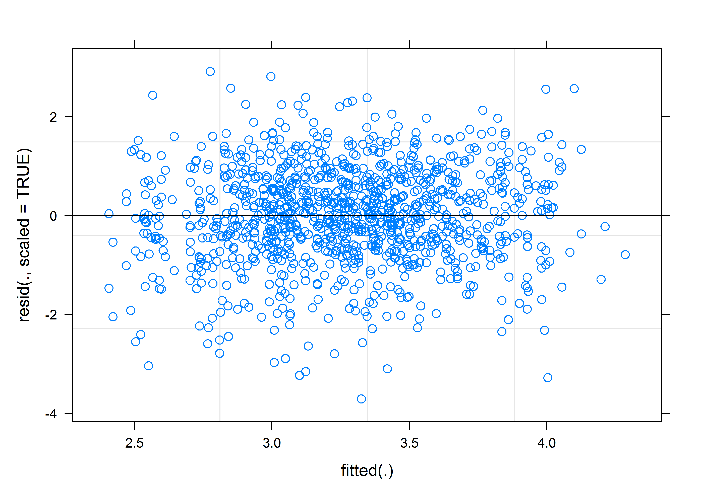
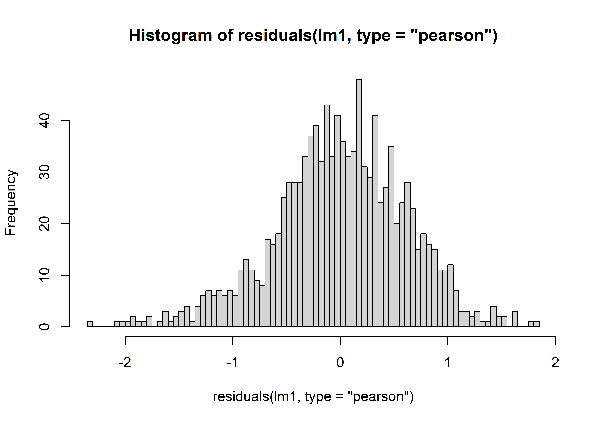
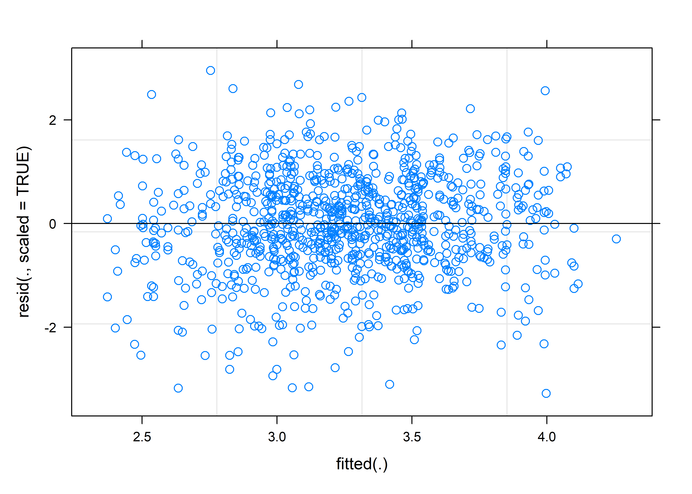
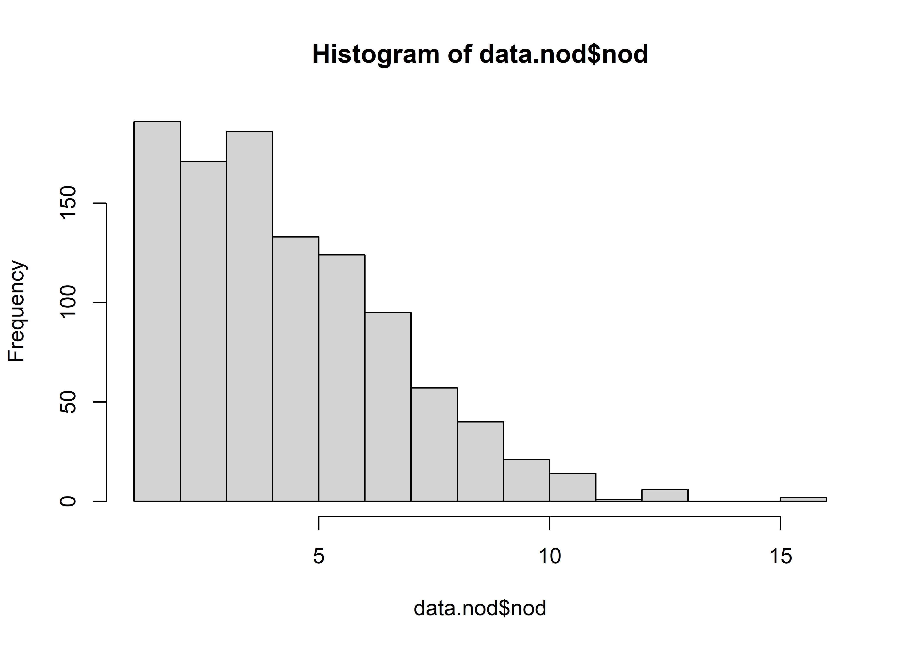
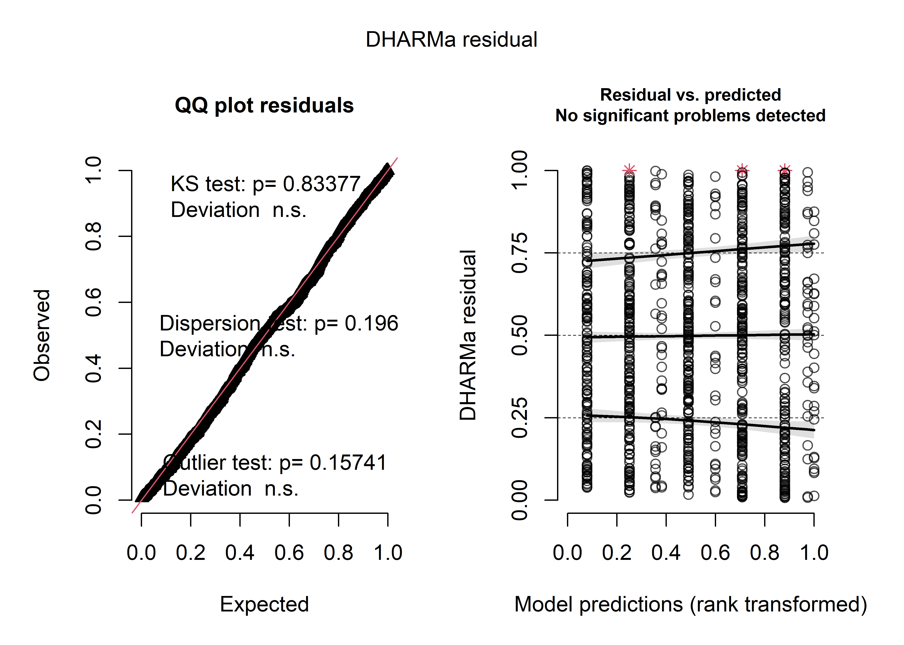
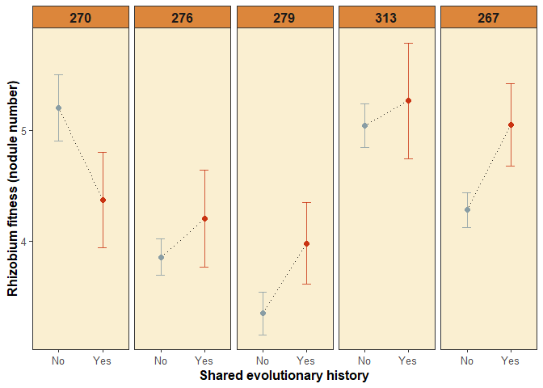
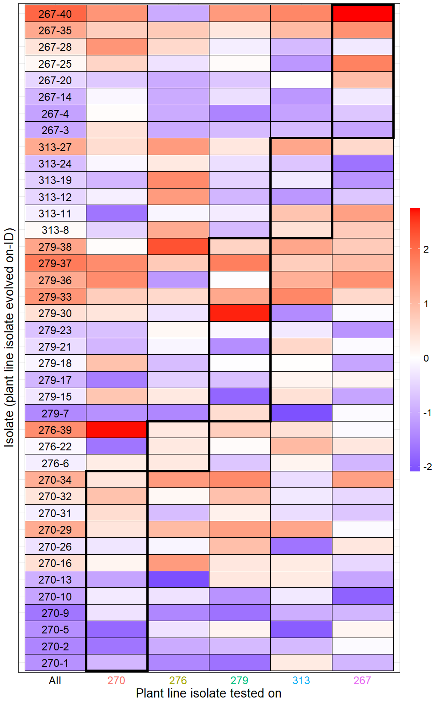
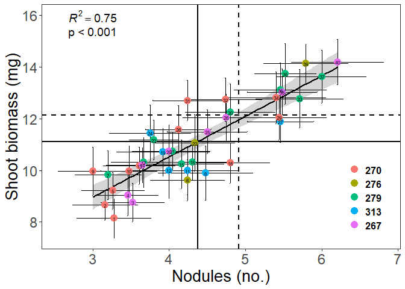

Single-inoculation experiment: analyses of phenotypes
================
Rebecca Batstone
2020-05-27

## Setup

### Global setup, load relevant packages

``` r
# Global setup
knitr::opts_chunk$set(echo = TRUE)

# Packages
library("tidyverse") ## includes ggplot2, dplyr, readr, stringr
library("car") ## Anova function
library("lme4") ## mixed effects models
library("knitr") ## produce the knitted doc
library("cowplot") ## produce paneled plots
library("DHARMa") ## residual diagnostics for glmm
library("RColorBrewer") ## color palettes
library("wesanderson") ## more color palettes
library("lmerTest") ## lmerModLmerTest
library("reshape2") ## dcast function
library("corrplot") ## to make correlation plots
library("psych") ## calculate p-vals of correlation matrix
```

### Load data

First, we need to read in and tidy the data

``` r
plants_all <- read_csv("./Data/single_evo_18Jan2018.csv", 
    col_types = cols(tray = col_character())) ## load data from single inoculation experiment

# make a unique plant ID
plants_all$plant_ID <- as.factor(do.call(paste, 
                                         c(plants_all[c("group","tray","plant")], sep = "-"))) 

# exclude controls for downstream analyses
plants <- droplevels(subset(plants_all, ! tray_type %in% c("control"))) 

# Load isolate data, with the original plant genotype they associated with
isolate_info <- read_csv("./Data/isolate_info.csv")

# match isolate ID to origin, using isolate_info
plants$origin <- isolate_info$line_origin[match(plants$isolate, 
                                               isolate_info$isolate)] 

# make isolate ID a combination of origin and isolate 
plants$origin_isolate <- as.factor(paste0(plants$origin, "-", 
                                      plants$isolate))

# Determine whether isolates share an evolutionary history with plant line being assayed
plants$line_origin <- do.call(paste, c(plants[c("line","origin")], sep = "-")) # create a column combining "line" and "origin"
plants$history <- ifelse(grepl("anc1021", plants$line_origin, ignore.case = T), "anc1021",
         ifelse(grepl("anc1022", plants$line_origin, ignore.case = T), "anc1022",              
         ifelse(grepl("270-270", plants$line_origin, ignore.case = T), "Yes",
         ifelse(grepl("276-276", plants$line_origin, ignore.case = T), "Yes",
         ifelse(grepl("279-279", plants$line_origin, ignore.case = T), "Yes", 
         ifelse(grepl("267-267", plants$line_origin, ignore.case = T), "Yes",
         ifelse(grepl("313-313", plants$line_origin, ignore.case = T), "Yes",
                "No")))))))

# Make key variables factors
plants$history <- factor(plants$history, levels = c("anc1021","anc1022","No","Yes"))
plants$line <- as.factor(plants$line)
plants$group <- as.factor(plants$group)
plants$tray <- as.factor(plants$tray)
plants$isolate <- as.factor(plants$isolate)

plants_Em1022 <- droplevels(subset(plants, strain == "Em1022")) ## subset to Em1022 only

#str(plants_Em1022) ## 1150 plants
```

## Models

### How does the quality of rhizobia as symbionts differ between ancestral and derived strains? And does it depend on shared evolutionary history?

``` r
data.shoot <- subset(plants_Em1022, !is.na(shoot)) ## remove all trait values that are NAs

# Two models
# First model asks whether ancestral and derived isolates differ:
lm1 <- lmer(sqrt(shoot) ~ line + evo_state + (1|isolate) + (1|tray), data.shoot)
(lmm1_sum <- summary(lm1))
```

    ## Linear mixed model fit by REML. t-tests use Satterthwaite's method [
    ## lmerModLmerTest]
    ## Formula: sqrt(shoot) ~ line + evo_state + (1 | isolate) + (1 | tray)
    ##    Data: data.shoot
    ## 
    ## REML criterion at convergence: 2206.7
    ## 
    ## Scaled residuals: 
    ##     Min      1Q  Median      3Q     Max 
    ## -3.7096 -0.5853  0.0151  0.6748  2.9139 
    ## 
    ## Random effects:
    ##  Groups   Name        Variance Std.Dev.
    ##  tray     (Intercept) 0.052342 0.22878 
    ##  isolate  (Intercept) 0.003243 0.05695 
    ##  Residual             0.394674 0.62823 
    ## Number of obs: 1108, groups:  tray, 50; isolate, 43
    ## 
    ## Fixed effects:
    ##                    Estimate Std. Error         df t value Pr(>|t|)    
    ## (Intercept)         3.43008    0.08305   17.94851  41.300  < 2e-16 ***
    ## line270            -0.23185    0.06060 1046.42420  -3.826 0.000138 ***
    ## line276             0.40374    0.05912 1045.28885   6.829 1.45e-11 ***
    ## line279            -0.52814    0.06068 1048.28297  -8.703  < 2e-16 ***
    ## line313            -0.06019    0.05912 1046.25218  -1.018 0.308864    
    ## evo_statederived   -0.10281    0.07074    7.54754  -1.453 0.186415    
    ## ---
    ## Signif. codes:  0 '***' 0.001 '**' 0.01 '*' 0.05 '.' 0.1 ' ' 1
    ## 
    ## Correlation of Fixed Effects:
    ##             (Intr) lin270 lin276 lin279 lin313
    ## line270     -0.348                            
    ## line276     -0.357  0.487                     
    ## line279     -0.347  0.477  0.489              
    ## line313     -0.359  0.492  0.502  0.491       
    ## evo_sttdrvd -0.763  0.001  0.001 -0.001  0.002

``` r
(ANODEV_shoot_state <- Anova(lm1, type=2)) ## no interaction, use type II SS
```

    ## Analysis of Deviance Table (Type II Wald chisquare tests)
    ## 
    ## Response: sqrt(shoot)
    ##              Chisq Df Pr(>Chisq)    
    ## line      253.9074  4     <2e-16 ***
    ## evo_state   2.1121  1     0.1461    
    ## ---
    ## Signif. codes:  0 '***' 0.001 '**' 0.01 '*' 0.05 '.' 0.1 ' ' 1

``` r
# Check model diagnostics
plot(lm1, resid(., scaled=TRUE) ~ fitted(.), abline = 0)
```

<!-- -->

``` r
hist(residuals(lm1, type = "pearson" ), breaks = 100)
```

<!-- -->

``` r
qqnorm(residuals(lm1))
```

<!-- -->

``` r
ggplot(data.frame(lev=hatvalues(lm1),pearson=residuals(lm1,type="pearson")),
      aes(x=lev,y=pearson)) +
    geom_point() +
    theme_bw()
```

<!-- -->

``` r
## all model diagnostics look ok

# test significance of random terms
lm1_isolate <- lmer(sqrt(shoot)~ line + evo_state + (1|tray), data.shoot)
lm1_tray <- lmer(sqrt(shoot)~ line + evo_state + (1|isolate), data.shoot)
(lm1_isolate_anova <- anova(lm1, lm1_isolate))
```

    ## Data: data.shoot
    ## Models:
    ## lm1_isolate: sqrt(shoot) ~ line + evo_state + (1 | tray)
    ## lm1: sqrt(shoot) ~ line + evo_state + (1 | isolate) + (1 | tray)
    ##             npar    AIC    BIC  logLik deviance  Chisq Df Pr(>Chisq)
    ## lm1_isolate    8 2198.3 2238.4 -1091.1   2182.3                     
    ## lm1            9 2200.2 2245.3 -1091.1   2182.2 0.0772  1     0.7812

``` r
(lm1_tray_anova <- anova(lm1, lm1_tray))
```

    ## Data: data.shoot
    ## Models:
    ## lm1_tray: sqrt(shoot) ~ line + evo_state + (1 | isolate)
    ## lm1: sqrt(shoot) ~ line + evo_state + (1 | isolate) + (1 | tray)
    ##          npar    AIC    BIC  logLik deviance  Chisq Df Pr(>Chisq)    
    ## lm1_tray    8 2230.6 2270.7 -1107.3   2214.6                         
    ## lm1         9 2200.2 2245.3 -1091.1   2182.2 32.424  1  1.239e-08 ***
    ## ---
    ## Signif. codes:  0 '***' 0.001 '**' 0.01 '*' 0.05 '.' 0.1 ' ' 1

``` r
# Subset the data to just the derived isolates
data.shoot.der = droplevels(subset(data.shoot, history != "anc1022")) 

# Second model: Fit a model with the fixed effect of line and isolate origin (home vs. away), 
## and isolate and group/tray (blocks in the greenhouse) as random effects
lm2 <- lmer(sqrt(shoot)~ line + history + (1|isolate) + (1|tray), data.shoot.der) 
## fit a line*comp interaction too, but it was not significant so it was removed

# Summarize model
(lmm2_sum <- summary(lm2))
```

    ## Linear mixed model fit by REML. t-tests use Satterthwaite's method [
    ## lmerModLmerTest]
    ## Formula: sqrt(shoot) ~ line + history + (1 | isolate) + (1 | tray)
    ##    Data: data.shoot.der
    ## 
    ## REML criterion at convergence: 1926.8
    ## 
    ## Scaled residuals: 
    ##     Min      1Q  Median      3Q     Max 
    ## -3.2755 -0.5740 -0.0036  0.6609  2.9509 
    ## 
    ## Random effects:
    ##  Groups   Name        Variance Std.Dev.
    ##  tray     (Intercept) 0.043692 0.20903 
    ##  isolate  (Intercept) 0.008194 0.09052 
    ##  Residual             0.394031 0.62772 
    ## Number of obs: 965, groups:  tray, 50; isolate, 40
    ## 
    ## Fixed effects:
    ##              Estimate Std. Error        df t value Pr(>|t|)    
    ## (Intercept)   3.30299    0.05664 229.19437  58.316  < 2e-16 ***
    ## line270      -0.22892    0.06514 910.68863  -3.514 0.000463 ***
    ## line276       0.42487    0.06383 911.02662   6.656 4.85e-11 ***
    ## line279      -0.54343    0.06506 912.04520  -8.352 2.47e-16 ***
    ## line313      -0.06414    0.06348 911.17514  -1.010 0.312533    
    ## historyYes    0.11463    0.05285 912.56147   2.169 0.030359 *  
    ## ---
    ## Signif. codes:  0 '***' 0.001 '**' 0.01 '*' 0.05 '.' 0.1 ' ' 1
    ## 
    ## Correlation of Fixed Effects:
    ##            (Intr) lin270 lin276 lin279 lin313
    ## line270    -0.533                            
    ## line276    -0.577  0.476                     
    ## line279    -0.538  0.481  0.480              
    ## line313    -0.570  0.489  0.502  0.488       
    ## historyYes -0.189 -0.067  0.108 -0.050  0.044

``` r
(ANODEV_shoot_history <- Anova(lm2, type=2)) ## no interaction, use type II SS
```

    ## Analysis of Deviance Table (Type II Wald chisquare tests)
    ## 
    ## Response: sqrt(shoot)
    ##            Chisq Df Pr(>Chisq)    
    ## line    229.7388  4     <2e-16 ***
    ## history   4.7035  1     0.0301 *  
    ## ---
    ## Signif. codes:  0 '***' 0.001 '**' 0.01 '*' 0.05 '.' 0.1 ' ' 1

``` r
## history significantly increases symbiont quality

# Check model diagnostics
plot(lm2, resid(., scaled=TRUE) ~ fitted(.), abline = 0)
```

<!-- -->

``` r
hist(residuals(lm2, type = "pearson" ), breaks = 100)
```

<!-- -->

``` r
qqnorm(residuals(lm2))
```

<!-- -->

``` r
ggplot(data.frame(lev=hatvalues(lm2),pearson=residuals(lm2,type="pearson")),
      aes(x=lev,y=pearson)) +
    geom_point() +
    theme_bw()
```

<!-- -->

``` r
## All model diagnostics look ok

# test significance of random terms
lm2_isolate <- lmer(sqrt(shoot)~ line + history + (1|tray), data.shoot.der)
lm2_tray <- lmer(sqrt(shoot)~ line + history + (1|isolate), data.shoot.der)
(lm2_isolate_anova <- anova(lm2, lm2_isolate))
```

    ## Data: data.shoot.der
    ## Models:
    ## lm2_isolate: sqrt(shoot) ~ line + history + (1 | tray)
    ## lm2: sqrt(shoot) ~ line + history + (1 | isolate) + (1 | tray)
    ##             npar    AIC    BIC  logLik deviance  Chisq Df Pr(>Chisq)
    ## lm2_isolate    8 1919.3 1958.3 -951.65   1903.3                     
    ## lm2            9 1920.3 1964.2 -951.17   1902.3 0.9539  1     0.3287

``` r
(lm2_tray_anova <- anova(lm2, lm2_tray))
```

    ## Data: data.shoot.der
    ## Models:
    ## lm2_tray: sqrt(shoot) ~ line + history + (1 | isolate)
    ## lm2: sqrt(shoot) ~ line + history + (1 | isolate) + (1 | tray)
    ##          npar    AIC    BIC  logLik deviance  Chisq Df Pr(>Chisq)    
    ## lm2_tray    8 1930.8 1969.7 -957.38   1914.8                         
    ## lm2         9 1920.3 1964.2 -951.17   1902.3 12.414  1  0.0004262 ***
    ## ---
    ## Signif. codes:  0 '***' 0.001 '**' 0.01 '*' 0.05 '.' 0.1 ' ' 1

### How does the fitness of rhizobia differ between ancestral and derived strains? And does it depend on shared evolutionary history?

Next, we’ll move to rhizobium fitness, measured by nodule
number.

``` r
data.nod <- subset(plants_Em1022, !is.na(nod) & nod > 0) ## remove all nod values that are NA or zero
hist(data.nod$nod) ## not normal, trying Poisson error distribution because it is count data
```

<!-- -->

``` r
# Two models
## First model asks whether ancestral and derived isolates differ
glm1 <- glmer(nod ~ line + evo_state + (1|isolate) + (1|tray), data.nod, family="poisson",
              control=glmerControl(optimizer="bobyqa",
                           optCtrl=list(maxfun=1000000)))

# Model summary
(glmm1_sum <- summary(glm1))
```

    ## Generalized linear mixed model fit by maximum likelihood (Laplace
    ##   Approximation) [glmerMod]
    ##  Family: poisson  ( log )
    ## Formula: nod ~ line + evo_state + (1 | isolate) + (1 | tray)
    ##    Data: data.nod
    ## Control: glmerControl(optimizer = "bobyqa", optCtrl = list(maxfun = 1e+06))
    ## 
    ##      AIC      BIC   logLik deviance df.resid 
    ##   4632.2   4671.8  -2308.1   4616.2     1033 
    ## 
    ## Scaled residuals: 
    ##     Min      1Q  Median      3Q     Max 
    ## -2.2629 -0.6885 -0.0862  0.6143  4.3765 
    ## 
    ## Random effects:
    ##  Groups  Name        Variance Std.Dev.
    ##  tray    (Intercept) 0.018149 0.13472 
    ##  isolate (Intercept) 0.009093 0.09536 
    ## Number of obs: 1041, groups:  tray, 50; isolate, 43
    ## 
    ## Fixed effects:
    ##                  Estimate Std. Error z value Pr(>|z|)    
    ## (Intercept)       1.57889    0.07781  20.291  < 2e-16 ***
    ## line270           0.22384    0.04430   5.053 4.36e-07 ***
    ## line276          -0.11373    0.04600  -2.472 0.013421 *  
    ## line279          -0.13836    0.04865  -2.844 0.004452 ** 
    ## line313           0.15428    0.04281   3.603 0.000314 ***
    ## evo_statederived -0.08201    0.07347  -1.116 0.264328    
    ## ---
    ## Signif. codes:  0 '***' 0.001 '**' 0.01 '*' 0.05 '.' 0.1 ' ' 1
    ## 
    ## Correlation of Fixed Effects:
    ##             (Intr) lin270 lin276 lin279 lin313
    ## line270     -0.284                            
    ## line276     -0.279  0.485                     
    ## line279     -0.263  0.462  0.445              
    ## line313     -0.301  0.526  0.504  0.481       
    ## evo_sttdrvd -0.859 -0.005  0.002  0.001  0.003

``` r
(ANODEV_nod_state <- Anova(glm1, type=2)) ## no interaction, use type II SS
```

    ## Analysis of Deviance Table (Type II Wald chisquare tests)
    ## 
    ## Response: nod
    ##             Chisq Df Pr(>Chisq)    
    ## line      96.0862  4     <2e-16 ***
    ## evo_state  1.2459  1     0.2643    
    ## ---
    ## Signif. codes:  0 '***' 0.001 '**' 0.01 '*' 0.05 '.' 0.1 ' ' 1

``` r
# Check residual diagnostics
simOut <- simulateResiduals(fittedModel = glm1, n = 1000)
plot(simOut)
```

<!-- -->

``` r
deviance(glm1)/df.residual(glm1) ## close to 1, so good
```

    ## [1] 1.042235

``` r
testDispersion(simOut)
```

<!-- -->

    ## 
    ##  DHARMa nonparametric dispersion test via sd of residuals fitted vs.
    ##  simulated
    ## 
    ## data:  simulationOutput
    ## ratioObsSim = 1.0364, p-value = 0.246
    ## alternative hypothesis: two.sided

``` r
# test significance of random terms
glm1_isolate <- glmer(nod ~ line + evo_state + (1|tray), data.nod, family="poisson",
              control=glmerControl(optimizer="bobyqa",
                           optCtrl=list(maxfun=1000000)))
glm1_tray <- glmer(nod ~ line + evo_state + (1|isolate), data.nod, family="poisson",
              control=glmerControl(optimizer="bobyqa",
                           optCtrl=list(maxfun=1000000)))
(glm1_isolate_anova <- anova(glm1, glm1_isolate))
```

    ## Data: data.nod
    ## Models:
    ## glm1_isolate: nod ~ line + evo_state + (1 | tray)
    ## glm1: nod ~ line + evo_state + (1 | isolate) + (1 | tray)
    ##              npar    AIC    BIC  logLik deviance Chisq Df Pr(>Chisq)  
    ## glm1_isolate    7 4636.3 4670.9 -2311.1   4622.3                      
    ## glm1            8 4632.2 4671.8 -2308.1   4616.2 6.022  1    0.01413 *
    ## ---
    ## Signif. codes:  0 '***' 0.001 '**' 0.01 '*' 0.05 '.' 0.1 ' ' 1

``` r
(glm1_tray_anova <- anova(glm1, glm1_tray))
```

    ## Data: data.nod
    ## Models:
    ## glm1_tray: nod ~ line + evo_state + (1 | isolate)
    ## glm1: nod ~ line + evo_state + (1 | isolate) + (1 | tray)
    ##           npar    AIC    BIC  logLik deviance  Chisq Df Pr(>Chisq)    
    ## glm1_tray    7 4654.7 4689.3 -2320.3   4640.7                         
    ## glm1         8 4632.2 4671.8 -2308.1   4616.2 24.436  1  7.682e-07 ***
    ## ---
    ## Signif. codes:  0 '***' 0.001 '**' 0.01 '*' 0.05 '.' 0.1 ' ' 1

``` r
# Subset the data to just the derived isolates
data.nod.der = droplevels(subset(data.nod, history != "anc1022"))
# Model 2: Fit GLMM with Poisson error distribution
glm2 <- glmer(nod ~ line*history + (1|isolate) + (1|tray), data.nod.der, family="poisson",
              control=glmerControl(optimizer="bobyqa",
                                   optCtrl=list(maxfun=1000000)))

# Model summary
(glmm2_sum <- summary(glm2)) ## there is a significant interaction for line 270 and evolutionary history, 
```

    ## Generalized linear mixed model fit by maximum likelihood (Laplace
    ##   Approximation) [glmerMod]
    ##  Family: poisson  ( log )
    ## Formula: nod ~ line * history + (1 | isolate) + (1 | tray)
    ##    Data: data.nod.der
    ## Control: glmerControl(optimizer = "bobyqa", optCtrl = list(maxfun = 1e+06))
    ## 
    ##      AIC      BIC   logLik deviance df.resid 
    ##   4012.5   4070.2  -1994.2   3988.5      892 
    ## 
    ## Scaled residuals: 
    ##     Min      1Q  Median      3Q     Max 
    ## -2.2936 -0.7048 -0.0874  0.6305  4.2268 
    ## 
    ## Random effects:
    ##  Groups  Name        Variance Std.Dev.
    ##  tray    (Intercept) 0.01539  0.1240  
    ##  isolate (Intercept) 0.01154  0.1074  
    ## Number of obs: 904, groups:  tray, 50; isolate, 40
    ## 
    ## Fixed effects:
    ##                    Estimate Std. Error z value Pr(>|z|)    
    ## (Intercept)         1.46499    0.04625  31.673  < 2e-16 ***
    ## line270             0.30316    0.05587   5.426 5.75e-08 ***
    ## line276            -0.07818    0.05458  -1.432  0.15204    
    ## line279            -0.13717    0.06272  -2.187  0.02875 *  
    ## line313             0.16191    0.05247   3.086  0.00203 ** 
    ## historyYes          0.17880    0.08757   2.042  0.04118 *  
    ## line270:historyYes -0.30578    0.12246  -2.497  0.01252 *  
    ## line276:historyYes -0.17573    0.16711  -1.052  0.29298    
    ## line279:historyYes -0.08281    0.12955  -0.639  0.52270    
    ## line313:historyYes -0.14662    0.13138  -1.116  0.26443    
    ## ---
    ## Signif. codes:  0 '***' 0.001 '**' 0.01 '*' 0.05 '.' 0.1 ' ' 1
    ## 
    ## Correlation of Fixed Effects:
    ##             (Intr) lin270 lin276 lin279 lin313 hstryY l270:Y l276:Y l279:Y
    ## line270     -0.596                                                        
    ## line276     -0.610  0.503                                                 
    ## line279     -0.536  0.437  0.452                                          
    ## line313     -0.634  0.528  0.534  0.470                                   
    ## historyYes  -0.421  0.365  0.358  0.331  0.374                            
    ## ln270:hstrY  0.306 -0.524 -0.260 -0.230 -0.268 -0.743                     
    ## ln276:hstrY  0.231 -0.183 -0.372 -0.170 -0.198 -0.539  0.383              
    ## ln279:hstrY  0.296 -0.236 -0.247 -0.542 -0.253 -0.709  0.502  0.372       
    ## ln313:hstrY  0.287 -0.242 -0.235 -0.216 -0.460 -0.683  0.488  0.355  0.465

``` r
## so keeping the line*history interaction
(ANODEV_nod_history <- Anova(glm2, type=3)) ## interaction, use type III SS
```

    ## Analysis of Deviance Table (Type III Wald chisquare tests)
    ## 
    ## Response: nod
    ##                  Chisq Df Pr(>Chisq)    
    ## (Intercept)  1003.2069  1  < 2.2e-16 ***
    ## line           76.8900  4  7.935e-16 ***
    ## history         4.1687  1    0.04118 *  
    ## line:history    6.8176  4    0.14585    
    ## ---
    ## Signif. codes:  0 '***' 0.001 '**' 0.01 '*' 0.05 '.' 0.1 ' ' 1

``` r
## Check residual diagnostics
simOut <- simulateResiduals(fittedModel = glm2, n = 1000)
plot(simOut)
```

<!-- -->

``` r
deviance(glm2)/df.residual(glm2) ## close to 1, so good
```

    ## [1] 1.028909

``` r
testDispersion(simOut)
```

<!-- -->

    ## 
    ##  DHARMa nonparametric dispersion test via sd of residuals fitted vs.
    ##  simulated
    ## 
    ## data:  simulationOutput
    ## ratioObsSim = 1.0336, p-value = 0.31
    ## alternative hypothesis: two.sided

``` r
# test significance of random terms
glm2_isolate <- glmer(nod ~ line*history + (1|tray), data.nod.der, family="poisson",
              control=glmerControl(optimizer="bobyqa",
                           optCtrl=list(maxfun=1000000)))
glm2_tray <- glmer(nod ~ line*history + (1|isolate), data.nod.der, family="poisson",
              control=glmerControl(optimizer="bobyqa",
                           optCtrl=list(maxfun=1000000)))
(glm2_isolate_anova <- anova(glm2, glm2_isolate))
```

    ## Data: data.nod.der
    ## Models:
    ## glm2_isolate: nod ~ line * history + (1 | tray)
    ## glm2: nod ~ line * history + (1 | isolate) + (1 | tray)
    ##              npar    AIC    BIC  logLik deviance  Chisq Df Pr(>Chisq)   
    ## glm2_isolate   11 4018.0 4070.9 -1998.0   3996.0                        
    ## glm2           12 4012.5 4070.2 -1994.2   3988.5 7.5419  1   0.006028 **
    ## ---
    ## Signif. codes:  0 '***' 0.001 '**' 0.01 '*' 0.05 '.' 0.1 ' ' 1

``` r
(glm2_tray_anova <- anova(glm2, glm2_tray))
```

    ## Data: data.nod.der
    ## Models:
    ## glm2_tray: nod ~ line * history + (1 | isolate)
    ## glm2: nod ~ line * history + (1 | isolate) + (1 | tray)
    ##           npar    AIC    BIC  logLik deviance  Chisq Df Pr(>Chisq)    
    ## glm2_tray   11 4022.9 4075.8 -2000.5   4000.9                         
    ## glm2        12 4012.5 4070.2 -1994.2   3988.5 12.447  1  0.0004187 ***
    ## ---
    ## Signif. codes:  0 '***' 0.001 '**' 0.01 '*' 0.05 '.' 0.1 ' ' 1

## Figures

### Figure 2

Visualize how rhizobia quality and fitness depend on the match between
rhizobia and host genotypes.

``` r
# summarize for isolates
means_line_history <- plants_Em1022 %>% 
  group_by(line, history) %>% 
  summarize(n=n(), mean_shoot = mean(shoot, na.rm=TRUE), 
            mean_nod = mean(nod, na.rm=TRUE), 
            sd_shoot = sd(shoot, na.rm=TRUE), 
            sd_nod = sd(nod, na.rm=TRUE), 
            se_shoot = sd_shoot/sqrt(n), 
            se_nod = sd_nod/sqrt(n)) %>%
  as.data.frame(.)

levels(means_line_history$history) <- c("1022", "No", "Yes")
means_line_history$line <- factor(means_line_history$line, levels=c("270", "276", "279", "313", "267")) ## order plant lines
palette <- "Royal1"

#Make figures
(figa <- ggplot(data=subset(means_line_history, history != "1022"), aes(x=history, y=mean_shoot, color=history))+
  geom_line(aes(group=line), color="black", linetype="dotted", alpha=0.8)+
  geom_point(size=2)+
  geom_errorbar(aes(x=history, ymin=mean_shoot-se_shoot, ymax=mean_shoot+se_shoot), width=0.2, alpha=0.8)+
  #geom_text(aes(x=history, y=7, label=n))+
  facet_grid(~line)+
  xlab("Shared evolutionary history")+
  ylab("Rhizobium quality (shoot biomass, mg)")+
  guides(color=FALSE)+
  scale_color_manual(values=wes_palette(palette))+
  theme_bw() +  
  theme(
    panel.background = element_rect(fill=wes_palette(palette)[[3]]), 
    strip.background = element_rect(fill=wes_palette(palette)[[4]]), 
    axis.title = element_text(size=12, face = "bold"),
    axis.text = element_text(size=10),
    panel.grid.major = element_blank(), 
    panel.grid.minor = element_blank(),
    strip.text =  element_text(face = "bold", size = 12)
    )
)
```

<!-- -->

``` r
(figb <- ggplot(data=subset(means_line_history, history != "1022"), aes(x=history, y=mean_nod, color=history))+
  geom_line(aes(group=line), color="black", linetype="dotted", alpha=0.8)+
  geom_point(size=2)+
  geom_errorbar(aes(x=history, ymin=mean_nod-se_nod, ymax=mean_nod+se_nod), width=0.2, alpha=0.8)+
  #geom_text(aes(x=history, y=3, label=n))+
  facet_grid(~line)+
  xlab("Shared evolutionary history")+
  ylab("Rhizobium fitness (nodule number)")+
  guides(color=FALSE)+
  scale_color_manual(values=wes_palette(palette))+
  theme_bw() +    
  theme(
    panel.background = element_rect(fill=wes_palette(palette)[[3]]), 
    strip.background = element_rect(fill=wes_palette(palette)[[4]]), 
    axis.title = element_text(size=12, face = "bold"),
    axis.text = element_text(size=10),
    panel.grid.major = element_blank(), 
    panel.grid.minor = element_blank(),
    strip.text =  element_text(face = "bold", size = 12)
    )
)
```

<!-- -->

``` r
fig <- plot_grid(figa, figb, ncol=2, labels=c("A", "B")) #Combine figure panels
save_plot("Figures/Figure2.pdf", fig, dpi = 1000, base_width=7) #Save plot
```

### Calculate raw and standardized means for GWAS analyses

``` r
# means across all environments
raw_means_all <- plants_Em1022 %>% 
  group_by(isolate, origin) %>% 
  summarize(n=n(), mean_shoot = mean(shoot, na.rm=TRUE), 
            mean_nod = mean(nod, na.rm=TRUE), 
            sd_shoot = sd(shoot, na.rm=TRUE), 
            sd_nod = sd(nod, na.rm=TRUE), 
            se_shoot = sd_shoot/sqrt(n), 
            se_nod = sd_nod/sqrt(n)) %>%
  as.data.frame(.)

raw_means_all$line <- "All"

# get isolate ID, based on shoot rank
raw_means_all_rank <- raw_means_all %>% 
  filter(origin != "anc1022") %>%
  mutate(iso_ID = rank(mean_shoot))

# means within each environment
raw_means_line <- plants_Em1022 %>% 
  group_by(line, isolate, origin) %>% 
  summarize(n=n(), mean_shoot = mean(shoot, na.rm=TRUE), 
            mean_nod = mean(nod, na.rm=TRUE), 
            sd_shoot = sd(shoot, na.rm=TRUE), 
            sd_nod = sd(nod, na.rm=TRUE), 
            se_shoot = sd_shoot/sqrt(n), 
            se_nod = sd_nod/sqrt(n)) %>%
  as.data.frame(.)

# combine both:
raw_means <- rbind(raw_means_line, raw_means_all)

# add in iso_ID (based on shoot rank)
raw_means$iso_ID <- raw_means_all_rank$iso_ID[match(raw_means$isolate, 
                                               raw_means_all_rank$isolate)] 
# Add in shared evolutionary history
raw_means$line_origin <- do.call(paste, c(raw_means[c("line","origin")], sep = "-")) # create a column combining "line" and "origin"
raw_means$history <- ifelse(grepl("anc1021", raw_means$line_origin, ignore.case = T), "anc1021",
         ifelse(grepl("anc1022", raw_means$line_origin, ignore.case = T), "anc1022",              
         ifelse(grepl("270-270", raw_means$line_origin, ignore.case = T), "Yes",
         ifelse(grepl("276-276", raw_means$line_origin, ignore.case = T), "Yes",
         ifelse(grepl("279-279", raw_means$line_origin, ignore.case = T), "Yes", 
         ifelse(grepl("267-267", raw_means$line_origin, ignore.case = T), "Yes",
         ifelse(grepl("313-313", raw_means$line_origin, ignore.case = T), "Yes",
                "No")))))))

# Make key variables factors
plants$history <- factor(plants$history, levels = c("anc1021","anc1022","No","Yes"))

# Standardize means
stand_means <- raw_means %>%
  group_by(line) %>%
  mutate(stand_shoot = (mean_shoot - mean(mean_shoot))/sd(mean_shoot),
         stand_nod = (mean_nod - mean(mean_nod))/sd(mean_nod)) %>%
  as.data.frame(.)

# check means
stand_means %>% 
  group_by(line) %>%
  summarize(mean_shoot = mean(stand_shoot),
            sd_shoot = sd(stand_shoot),
            mean_nod = mean(stand_nod),
            sd_nod = sd(stand_nod)) ## mean of 0, sd of 1
```

    ## # A tibble: 6 x 5
    ##   line  mean_shoot sd_shoot  mean_nod sd_nod
    ##   <fct>      <dbl>    <dbl>     <dbl>  <dbl>
    ## 1 267    -2.67e-16     1.00  3.84e-16   1   
    ## 2 270    -5.17e-17     1    -6.84e-17   1.00
    ## 3 276     3.74e-17     1     1.18e-16   1   
    ## 4 279     4.15e-17     1    -3.00e-17   1   
    ## 5 313    -3.27e-17     1.00  5.27e-17   1.  
    ## 6 All    -8.37e-17     1.00 -2.10e-17   1

``` r
# format for GEMMA (line as columns)
stand_means.w_shoot <- dcast(stand_means, isolate ~ line, value.var="stand_shoot")
colnames(stand_means.w_shoot)[2:7] <- paste("shoot", 
                                                colnames(stand_means.w_shoot[,c(2:7)]), sep = "_")
stand_means.w_nod <- dcast(stand_means, isolate ~ line, value.var="stand_nod")
colnames(stand_means.w_nod) <- paste("nod", colnames(stand_means.w_nod), sep = "_")
stand_means.w <- cbind(stand_means.w_shoot, stand_means.w_nod[,-1])                           
save(stand_means.w, file="Output/stand_means_for_GEMMA.Rdata")
```

### Figures S1 and S2

Heatmaps of isolate effects on each host

``` r
# heatmap variables:
stand_means$origin_iso <- do.call(paste, c(stand_means[c("origin","iso_ID")], sep = "-"))

# factor specifications
stand_means$line <- factor(stand_means$line, 
                                         levels = c("All", "270", "276",
                                                    "279", "313", "267"))
stand_means$origin <- factor(stand_means$origin, 
                                  levels = c("anc1022", "270",
                                              "276", "279", "313", "267"))

### order for figure
stand_means$origin_iso <- factor(stand_means$origin_iso,
                  levels = unique(stand_means$origin_iso[order(stand_means$origin,
                                                               stand_means$iso_ID)]))

stand_means.d <- filter(stand_means, origin_iso != "anc1022-NA")

### colour x-axis according to line
line_col <- c("black","#F8766D","#A3A500","#00BF7D","#00B0F6","#E76BF3")
names(line_col) <- levels(stand_means.d$line)

pdf("Figures/FigureS1.pdf", width = 10, height = 16)

(HM_shoot_IL<- ggplot(stand_means.d,
               aes(x = line, y = origin_iso, fill = stand_shoot))+
  geom_tile(color = "black") +
  xlab("Plant line isolate tested on") + 
  ylab("Isolate (plant line isolate evolved on-ID)") +
    
   scale_fill_gradient2(low = "blue",mid = "white", high = "red",
                      midpoint = 0,
                      space = "Lab",
                      name="Shoot biomass (g)") +
    
    # Label All column with isolate IDs (origin, overall rank)
    geom_text(data=subset(stand_means.d, line == "All"),
              aes(label = origin_iso), color = "black", size = 6) +
    theme_bw() +
    
    # add boxes around isolates that share an evolutionary history with the plant line being assayed
    annotate("rect", xmax = 2.5, ymax = 12.5, xmin= 1.5, ymin = 0.5, size = 2, colour="black", fill=NA)  + ## 270
    annotate("rect", xmax = 3.5, ymax = 15.5, xmin= 2.5, ymin = 12.5, size = 2, colour="black", fill=NA)  + ## 276
    annotate("rect", xmax = 4.5, ymax = 26.5, xmin= 3.5, ymin = 15.5, size = 2, colour="black", fill=NA)  + ## 279
    annotate("rect", xmax = 5.5, ymax = 32.5, xmin= 4.5, ymin = 26.5, size = 2, colour="black", fill=NA)  + ## 313
    annotate("rect", xmax = 6.5, ymax = 40.5, xmin= 5.5, ymin = 32.5, size = 2, colour="black", fill=NA)  + ## 267
    
    # Add asterisks to positive isolate effects when isolates share an evolutionary history with the plant line being assayed
    # geom_text(data=. %>%
    #           group_by(origin_iso) %>%
    #           filter(history == "Yes" & stand_shoot > 0),
    #           label = "*", size = 10, colour = "black", nudge_y = -0.3) +
 
    guides(colour=FALSE) +
    theme(axis.title.y = element_text(colour = "black", size = 20), 
        axis.text.y = element_blank(),
        axis.title.x = element_text(size=20), 
        axis.text.x = element_text(size=18, colour = line_col),
        axis.ticks = element_blank(),
        legend.title = element_blank(),
        legend.key.height = unit(1.2, "inch"),
        legend.text = element_text(size=16)))
```

    ## Warning: Vectorized input to `element_text()` is not officially supported.
    ## Results may be unexpected or may change in future versions of ggplot2.

``` r
dev.off()
```

    ## quartz_off_screen 
    ##                 2

``` r
HM_shoot_IL
```

<!-- -->

``` r
pdf("Figures/FigureS2.pdf", width = 10, height = 16)

(HM_nod_IL<- ggplot(stand_means.d,
               aes(x = line, y = origin_iso, fill = stand_nod))+
  geom_tile(color = "black") +
  xlab("Plant line isolate tested on") + 
  ylab("Isolate (plant line isolate evolved on-ID)") +
  scale_fill_gradient2(low = "blue",mid = "white", high = "red",
                      midpoint = 0,
                      space = "Lab",
                      name="Nodules (no.)") +
    theme_bw() +
 
    # Label All column with isolate IDs (origin, overall rank)
    geom_text(data=subset(stand_means.d, line == "All"),
              aes(label = origin_iso), color = "black", size = 6) +
    
    # add boxes around isolates that share an evolutionary history with the plant line being assayed
    annotate("rect", xmax = 2.5, ymax = 12.5, xmin= 1.5, ymin = 0.5, size = 2, colour="black", fill=NA)  + ## 270
    annotate("rect", xmax = 3.5, ymax = 15.5, xmin= 2.5, ymin = 12.5, size = 2, colour="black", fill=NA)  + ## 276
    annotate("rect", xmax = 4.5, ymax = 26.5, xmin= 3.5, ymin = 15.5, size = 2, colour="black", fill=NA)  + ## 279
    annotate("rect", xmax = 5.5, ymax = 32.5, xmin= 4.5, ymin = 26.5, size = 2, colour="black", fill=NA)  + ## 313
    annotate("rect", xmax = 6.5, ymax = 40.5, xmin= 5.5, ymin = 32.5, size = 2, colour="black", fill=NA)  + ## 267
    
    # Add asterisks to positive isolate effects when isolates share an evolutionary history with the plant line being assayed
    # geom_text(data=. %>%
    #           group_by(origin_iso) %>%
    #           filter(history == "Yes" & stand_nod > 0),
    #           label = "*", size = 10, colour = "black", nudge_y = -0.3) +
 
    guides(colour=FALSE) +
    theme(axis.title.y = element_text(colour = "black", size = 20), 
        axis.text.y = element_blank(),
        axis.title.x = element_text(size=20), 
        axis.text.x = element_text(size=18, colour = line_col),
        axis.ticks = element_blank(),
        legend.title = element_blank(),
        legend.key.height = unit(1.2, "inch"),
        legend.text = element_text(size=16)))
```

    ## Warning: Vectorized input to `element_text()` is not officially supported.
    ## Results may be unexpected or may change in future versions of ggplot2.

``` r
dev.off()
```

    ## quartz_off_screen 
    ##                 2

``` r
HM_nod_IL
```

<!-- -->

### Figure S3

Correlation between rhizobia quality and fitness (across hosts)

``` r
# Model for overall correlation:
# lm1
lm1 <- lm(mean_shoot ~ mean_nod, data=raw_means_all_rank)
summary(lm1)
```

    ## 
    ## Call:
    ## lm(formula = mean_shoot ~ mean_nod, data = raw_means_all_rank)
    ## 
    ## Residuals:
    ##     Min      1Q  Median      3Q     Max 
    ## -1.4977 -0.5815  0.1820  0.3698  1.8016 
    ## 
    ## Coefficients:
    ##             Estimate Std. Error t value Pr(>|t|)    
    ## (Intercept)   4.2560     0.6447   6.602 8.55e-08 ***
    ## mean_nod      1.5682     0.1446  10.848 3.39e-13 ***
    ## ---
    ## Signif. codes:  0 '***' 0.001 '**' 0.01 '*' 0.05 '.' 0.1 ' ' 1
    ## 
    ## Residual standard error: 0.7941 on 38 degrees of freedom
    ## Multiple R-squared:  0.7559, Adjusted R-squared:  0.7495 
    ## F-statistic: 117.7 on 1 and 38 DF,  p-value: 3.386e-13

``` r
Anova(lm1, type=2) # Significant positive correlation
```

    ## Anova Table (Type II tests)
    ## 
    ## Response: mean_shoot
    ##           Sum Sq Df F value    Pr(>F)    
    ## mean_nod  74.209  1  117.69 3.386e-13 ***
    ## Residuals 23.962 38                      
    ## ---
    ## Signif. codes:  0 '***' 0.001 '**' 0.01 '*' 0.05 '.' 0.1 ' ' 1

``` r
# order factor levels
raw_means_all_rank$origin <- factor(raw_means_all_rank$origin, 
                                         levels = c("270", "276", "279", "313", "267"))

(plot_corr <- ggplot(raw_means_all_rank, aes(x=mean_nod, y=mean_shoot)) +
  geom_smooth(method=lm, se=TRUE, colour="black") +
  geom_errorbar(aes(ymin=mean_shoot-se_shoot, ymax=mean_shoot+se_shoot), colour="black") +
  geom_errorbarh(aes(xmin=mean_nod-se_nod, xmax=mean_nod+se_nod), colour="black") +
 
  # population aves
  geom_hline(data=raw_means_all %>%
               filter(origin == "anc1022"),
             aes(yintercept=mean(mean_shoot)), colour="black", linetype=2, size = 1) +
  geom_vline(data=raw_means_all %>%
               filter(origin == "anc1022"),
             aes(xintercept=mean(mean_nod)), colour="black", linetype=2, size = 1) +
  geom_hline(data=raw_means_all %>%
               filter(origin != "anc1022"),
             aes(yintercept=mean(mean_shoot)), colour="black", linetype=1, size = 1) +
  geom_vline(data=raw_means_all %>%
               filter(origin != "anc1022"),
             aes(xintercept=mean(mean_nod)), colour="black", linetype=1, size = 1) +
  
  geom_point(aes(colour=origin), size=4) +  
  annotate("text", x = 3, y = 16, label="italic(R) ^ 2 == 0.750", parse = TRUE, size=5) +  
  annotate("text", x = 3, y = 15.4, label='p < 0.001', size=5) +    
  theme_bw() + 
  xlab("Nodules (no.)") + 
  ylab("Shoot biomass (mg)") +
  geom_text(aes(label=iso_ID), size = 2) +  

  theme(axis.title.y = element_text(colour = "black", size = 20), 
        axis.text.y = element_text(size=18), 
        axis.title.x = element_text(colour = "black", size = 20), 
        axis.text.x = element_text(size=18), 
        legend.title = element_blank(),
        legend.text = element_text(colour="black", size=12, face="bold"),
        legend.box.background = element_blank(),
        legend.background = element_blank(),
        legend.position=c(0.9,0.22),
        panel.grid.major = element_blank(), 
        panel.grid.minor = element_blank()))
```

    ## `geom_smooth()` using formula 'y ~ x'

<!-- -->

``` r
save_plot("Figures/FigureS3.pdf", plot_corr, dpi = 1000,
          base_aspect_ratio = 1.3)
```

    ## `geom_smooth()` using formula 'y ~ x'

### Figure S4

Correlations across host environments. First, need to make wide format
spreadsheets for each trait. Then, run corrplot on each.

``` r
# shoot biomass

stand_means.dw_shoot <- dcast(stand_means.d, iso_ID ~ line, value.var="stand_shoot")

# set line as row-names
stand_means.dw_shoot.m <- stand_means.dw_shoot[,-c(1:2)]
rownames(stand_means.dw_shoot.m) <- stand_means.dw_shoot[,1]

# set label colours
traitcolors1 <- c("#F8766D","#A3A500","#00BF7D","#00B0F6","#E76BF3")
names(traitcolors1) <- names(stand_means.dw_shoot.m)

# compute correlation matrix
stand_means.dw_shoot.mat <- cor(stand_means.dw_shoot.m, use="pairwise.complete.obs")

# compute the matrix of the p-value
source('./Source code/corr_test.R')

p.mat_shoot <- cor.mtest(stand_means.dw_shoot.m) ## uncorrected
p.mat_shoot.c <- psych::corr.test(stand_means.dw_shoot.m, adjust="bonferroni")$p ## corrected

# Nodules

stand_means.dw_nod <- dcast(stand_means.d, iso_ID ~ line, value.var="stand_nod")

# set line as row-names
stand_means.dw_nod.m <- stand_means.dw_nod[,-c(1:2)]
rownames(stand_means.dw_nod.m) <- stand_means.dw_nod[,1]

# compute correlation matrix
stand_means.dw_nod.mat <- cor(stand_means.dw_nod.m, use="pairwise.complete.obs")

p.mat_nod <- cor.mtest(stand_means.dw_nod.m) ## uncorrected
p.mat_nod.c <- psych::corr.test(stand_means.dw_nod.m, adjust="bonferroni")$p ## corrected

## corrplot figure

# upper
bg_colors_upper1 <- p.mat_shoot < 0.05
bg_colors_upper1[bg_colors_upper1 == T] <- "grey"
bg_colors_upper1[bg_colors_upper1 == F] <- "white"
diag(bg_colors_upper1) <- "white" # if the diagonal values shall be white
# select colors from lower/upper1 part of matrix:
bg_colors_upper1 <- bg_colors_upper1[upper.tri(bg_colors_upper1, diag=T)]

# lower
bg_colors_lower1 <- p.mat_nod < 0.05
bg_colors_lower1[bg_colors_lower1 == T] <- "grey"
bg_colors_lower1[bg_colors_lower1 == F] <- "white"
diag(bg_colors_lower1) <- "white" # if the diagonal values shall be white
# select colors from lower/lower1 part of matrix:
bg_colors_lower1 <- bg_colors_lower1[lower.tri(bg_colors_lower1, diag=T)]

### and the plot
pdf("Figures/FigureS4.pdf", width = 10, height = 10, pointsize = 14)

par(xpd = TRUE)

corrplot(stand_means.dw_shoot.mat, method = "ellipse", type="upper",
         #order="hclust", 
         addCoef.col = "black",
         tl.pos = "tl",
         tl.col = traitcolors1,
         tl.srt=70,
         col = rev(brewer.pal(n = 8, name = "RdYlBu")),
         cl.lim=c(0,1),
         # p.mat = p.mat1.o, sig.level = 0.1, insig = "p-value",
         number.digits = 3,
         bg = bg_colors_upper1,
         diag = TRUE,
         mar=c(0,0,2,3))
         
corrplot(stand_means.dw_nod.mat, method = "ellipse", type="lower",
         #order="hclust", 
         addCoef.col = "black",
         col = rev(brewer.pal(n = 8, name = "RdYlBu")),
         add=T, 
         tl.pos="n", 
         cl.pos="n",
         # p.mat = p.mat1.o, sig.level = 0.1, insig = "p-value",
         number.digits = 3,
         bg = bg_colors_lower1,
         diag = TRUE)

dev.off()
```

    ## quartz_off_screen 
    ##                 2
