Summary stats on VCF files
================
Rebecca Batstone
2020-05-27

## Load packages

``` r
library(tidyverse)
library(vcfR)
library(ape)
library("UpSetR") ## upset graphs
library(cowplot)
library(magick)

#function
Which.names <- function(DF, value){
  ind <- which(DF==value, arr.ind=TRUE)
  paste(rownames(DF)[ind[1:nrow(ind)]],  colnames(DF)[ind[1:nrow(ind),2]], sep=',')
}
```

# VCF summary stats using vcfR

Use vcfR package to examine important alignment parameters

## Full 1330 SNPs

### Summary statistics of vcf

First, on server, subset full vcf into the four genomic regions
(chromosome, accessory plasmid A, pSymA, pSymB).

``` bash
# on server:
$VCFTOOLS --vcf  KH35c_filt1.recode.vcf --chr CP021825.1 --recode --recode-INFO-all --out KH35c_full_chrom
## 236 SNPs kept

$VCFTOOLS --vcf  KH35c_filt1.recode.vcf --chr CP021826.1 --recode --recode-INFO-all --out KH35c_full_pAccA
## 6 SNPs kept

$VCFTOOLS --vcf  KH35c_filt1.recode.vcf --chr CP021827.1 --recode --recode-INFO-all --out KH35c_full_pSymA
## 565 SNPs kept

$VCFTOOLS --vcf  KH35c_filt1.recode.vcf --chr CP021828.1 --recode --recode-INFO-all --out KH35c_full_pSymB
## 523 SNPs kept

## zipped on server, scp'ed to my comp. 
```

## Construct the chrom objects

``` r
# reference file
ref <- ape::read.dna("./Data/GCA_002197105.1_ASM219710v1_genomic.fna", 
                     format = "fasta")

# chrom
ref_chrom <- ref[ grep( "CP021825.1 ", names(ref) ) ]
names(ref_chrom) <- "Chromosome"
ref_chrom <- as.matrix(ref_chrom)

# pAcc
ref_pAcc <- ref[ grep( "CP021826.1 ", names(ref) ) ]
names(ref_pAcc) <- "Accessory_plasmid"
ref_pAcc <- as.matrix(ref_pAcc)

# pSymA
ref_pSymA <- ref[ grep( "CP021827.1 ", names(ref) ) ]
names(ref_pSymA) <- "Symbiosis_plasmid_A"
ref_pSymA <- as.matrix(ref_pSymA)

# pSymB
ref_pSymB <- ref[ grep( "CP021828.1 ", names(ref) ) ]
names(ref_pSymB) <- "Symbiosis_plasmid_B"
ref_pSymB <- as.matrix(ref_pSymB)

# annotation file
gff <- read.table("./Data/GCA_002197105.1_ASM219710v1_genomic.gff", 
                  sep="\t", quote="")

gff_chrom <- gff[grep("NZ_CP021825.1", gff[,1]),]
gff_pAcc <- gff[grep("NZ_CP021826.1", gff[,1]),]
gff_pSymA <- gff[grep("NZ_CP021827.1", gff[,1]),]
gff_pSymB <- gff[grep("NZ_CP021828.1", gff[,1]),]

# vcf's
vcf_chrom <- read.vcfR("./Data/KH35c_full_regions/KH35c_full_chrom.recode.vcf")
```

    ## Scanning file to determine attributes.
    ## File attributes:
    ##   meta lines: 39
    ##   header_line: 40
    ##   variant count: 236
    ##   column count: 58
    ## Meta line 39 read in.
    ## All meta lines processed.
    ## gt matrix initialized.
    ## Character matrix gt created.
    ##   Character matrix gt rows: 236
    ##   Character matrix gt cols: 58
    ##   skip: 0
    ##   nrows: 236
    ##   row_num: 0
    ## Processed variant: 236
    ## All variants processed

``` r
vcf_pAcc <- read.vcfR("./Data/KH35c_full_regions/KH35c_full_pAccA.recode.vcf")
```

    ## Scanning file to determine attributes.
    ## File attributes:
    ##   meta lines: 39
    ##   header_line: 40
    ##   variant count: 6
    ##   column count: 58
    ## Meta line 39 read in.
    ## All meta lines processed.
    ## gt matrix initialized.
    ## Character matrix gt created.
    ##   Character matrix gt rows: 6
    ##   Character matrix gt cols: 58
    ##   skip: 0
    ##   nrows: 6
    ##   row_num: 0
    ## Processed variant: 6
    ## All variants processed

``` r
vcf_pSymA <- read.vcfR("./Data/KH35c_full_regions/KH35c_full_pSymA.recode.vcf")
```

    ## Scanning file to determine attributes.
    ## File attributes:
    ##   meta lines: 39
    ##   header_line: 40
    ##   variant count: 565
    ##   column count: 58
    ## Meta line 39 read in.
    ## All meta lines processed.
    ## gt matrix initialized.
    ## Character matrix gt created.
    ##   Character matrix gt rows: 565
    ##   Character matrix gt cols: 58
    ##   skip: 0
    ##   nrows: 565
    ##   row_num: 0
    ## Processed variant: 565
    ## All variants processed

``` r
vcf_pSymB <- read.vcfR("./Data/KH35c_full_regions/KH35c_full_pSymB.recode.vcf")
```

    ## Scanning file to determine attributes.
    ## File attributes:
    ##   meta lines: 39
    ##   header_line: 40
    ##   variant count: 523
    ##   column count: 58
    ## Meta line 39 read in.
    ## All meta lines processed.
    ## gt matrix initialized.
    ## Character matrix gt created.
    ##   Character matrix gt rows: 523
    ##   Character matrix gt cols: 58
    ##   skip: 0
    ##   nrows: 523
    ##   row_num: 0
    ## Processed variant: 523
    ## All variants processed

``` r
# create chrom objects
chrom <- create.chromR(name='Chromosome', vcf=vcf_chrom, seq=ref_chrom, ann=gff_chrom)
```

    ## Names in vcf:

    ##   CP021825.1

    ## Names of sequences:

    ##   Chromosome

    ## Warning in create.chromR(name = "Chromosome", vcf = vcf_chrom, seq = ref_chrom, : 
    ##         Names in variant data and sequence data do not match perfectly.
    ##         If you choose to proceed, we'll do our best to match the data.
    ##         But prepare yourself for unexpected results.

    ## Initializing var.info slot.

    ## var.info slot initialized.

``` r
chrom_pAcc <- create.chromR(name='Accessory_plasmid', vcf=vcf_pAcc, seq=ref_pAcc, ann=gff_pAcc)
```

    ## Names in vcf:

    ##   CP021826.1

    ## Names of sequences:

    ##   Accessory_plasmid

    ## Warning in create.chromR(name = "Accessory_plasmid", vcf = vcf_pAcc, seq = ref_pAcc, : 
    ##         Names in variant data and sequence data do not match perfectly.
    ##         If you choose to proceed, we'll do our best to match the data.
    ##         But prepare yourself for unexpected results.

    ## Initializing var.info slot.

    ## var.info slot initialized.

``` r
chrom_pSymA <- create.chromR(name='Symbiosis_plasmid_A', vcf=vcf_pSymA, seq=ref_pSymA, ann=gff_pSymA)
```

    ## Names in vcf:

    ##   CP021827.1

    ## Names of sequences:

    ##   Symbiosis_plasmid_A

    ## Warning in create.chromR(name = "Symbiosis_plasmid_A", vcf = vcf_pSymA, : 
    ##         Names in variant data and sequence data do not match perfectly.
    ##         If you choose to proceed, we'll do our best to match the data.
    ##         But prepare yourself for unexpected results.

    ## Initializing var.info slot.

    ## var.info slot initialized.

``` r
chrom_pSymB <- create.chromR(name='Symbiosis_plasmid_B', vcf=vcf_pSymB, seq=ref_pSymB, ann=gff_pSymB)
```

    ## Names in vcf:

    ##   CP021828.1

    ## Names of sequences:

    ##   Symbiosis_plasmid_B

    ## Warning in create.chromR(name = "Symbiosis_plasmid_B", vcf = vcf_pSymB, : 
    ##         Names in variant data and sequence data do not match perfectly.
    ##         If you choose to proceed, we'll do our best to match the data.
    ##         But prepare yourself for unexpected results.

    ## Initializing var.info slot.

    ## var.info slot initialized.

``` r
chrom <- proc.chromR(chrom, verbose=FALSE)
chrom_pAcc <- proc.chromR(chrom_pAcc, verbose=FALSE)
chrom_pSymA <- proc.chromR(chrom_pSymA, verbose=FALSE)
chrom_pSymB <- proc.chromR(chrom_pSymB, verbose=FALSE)

chromoqc(chrom, dp.alpha=20)
```

<!-- -->

``` r
chromoqc(chrom_pAcc, dp.alpha=20)
```

<!-- -->

``` r
chromoqc(chrom_pSymA, dp.alpha=20)
```

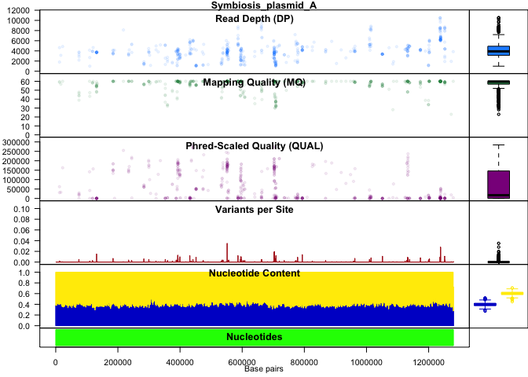<!-- -->

``` r
chromoqc(chrom_pSymB, dp.alpha=20)
```

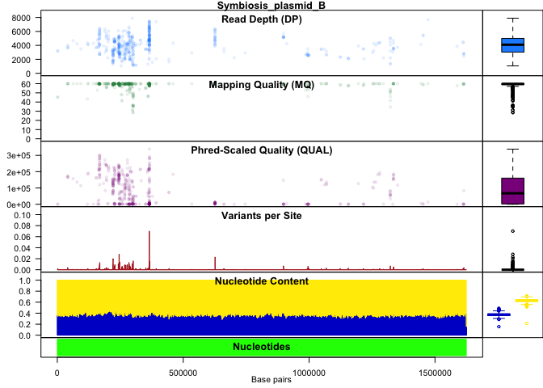<!-- -->

``` r
plot(chrom)
```

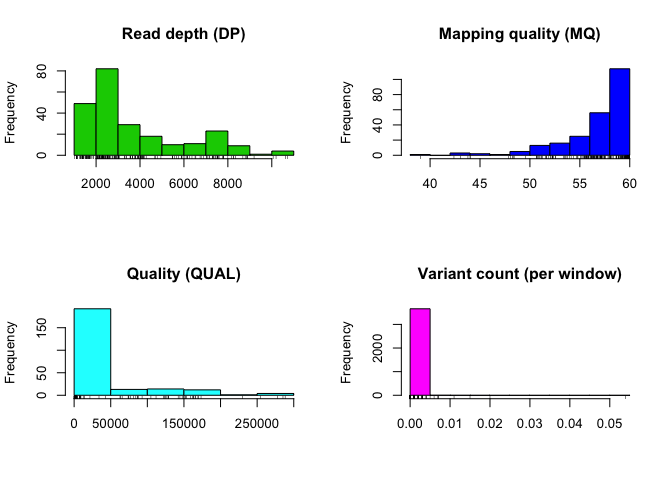<!-- -->

``` r
plot(chrom_pAcc)
```

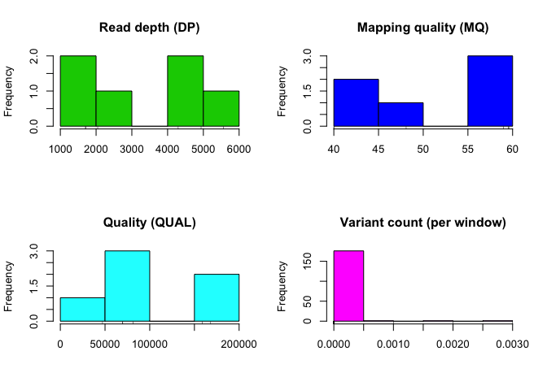<!-- -->

``` r
plot(chrom_pSymA)
```

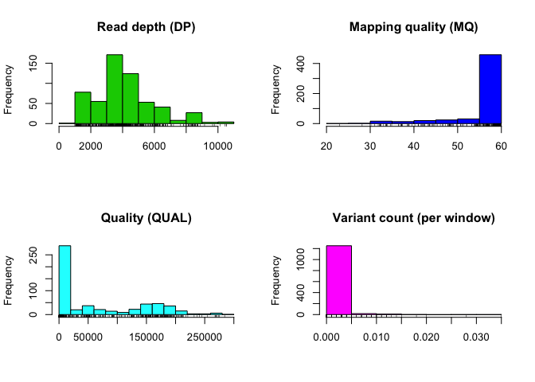<!-- -->

``` r
plot(chrom_pSymB)
```

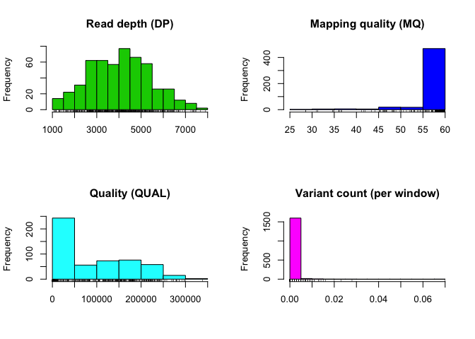<!-- -->

``` r
# Summarize per sample

# extract genotype
dp_chrom <- extract.gt(chrom, element="DP", as.numeric=TRUE)
rownames(dp_chrom) <- 1:nrow(dp_chrom)
head(dp_chrom)
```

    ##   270-A01-EPS--31 313-A06-EPS+-25 313-A09.1-EPS+-3 313-A09.2-EPS+-7 anc1022_1-1
    ## 1              48              26               51               34          23
    ## 2              35              26               51               34          23
    ## 3              35              26               51               34          23
    ## 4              34              21               74               23          17
    ## 5              30              37               87               24          29
    ## 6              30              37               87               24          29
    ##   anc1022_1-2 anc1022_1-3 anc1022_2-1 anc1022_2-2 anc1022_2-3 anc1022_3-1
    ## 1          17          12          13          13          47          19
    ## 2          17          12          13          13          47          19
    ## 3          17          12          13          13          47          19
    ## 4          14          18          14          17          42           4
    ## 5          21          15          12          10          45           6
    ## 6          21          15          12          10          45           6
    ##   anc1022_3-2 anc1022_3-3 267-A13.1-EPS--6 267-A13.2-EPS--33 279-B13.3-EPS--38
    ## 1          51          33               37                71                19
    ## 2          51          33               37                51                19
    ## 3          51          33               37                51                19
    ## 4          38          25               37                44                10
    ## 5          48          26               43                29                10
    ## 6          48          26               43                29                10
    ##   279-B13.2-EPS--14 279-B13.1-EPS--18 270-C13-EPS+-34 270-D01-EPS+-36
    ## 1                68                46              17               4
    ## 2                66                46              73               4
    ## 3                66                46              73               4
    ## 4                58                30              73               4
    ## 5                57                42              71               4
    ## 6                57                42              71               4
    ##   313-D09-EPS--17 267-D11-EPS--27 270-E07-EPS+-5 279-F02-EPS--11
    ## 1              47              61             33              28
    ## 2              47              38             33              40
    ## 3              47              38             33              40
    ## 4              62              22             20              32
    ## 5              60              28             25              37
    ## 6              60              28             25              37
    ##   267-F05-EPS--32 276-F06-EPS+-10 267-H01-EPS+-9 279-H11.2-EPS+-21
    ## 1              30              50             51                50
    ## 2              23              50             51                50
    ## 3              23              50             51                50
    ## 4               7             132            104                71
    ## 5              14             127             97                53
    ## 6              14             127             97                53
    ##   279-H11.1-EPS+-16 270-I03-EPS+-13 313-M10-EPS+-23 270-N10-EPS+-26
    ## 1                48              50              51              35
    ## 2                48              50              51              35
    ## 3                48              50              51              35
    ## 4                64              75              57              29
    ## 5                51              64              65              39
    ## 6                51              64              65              39
    ##   267-O12-EPS+-22 267-P06-EPS--40 279-P09.2-EPS--30 279-P09.1-EPS--35
    ## 1              50              17                38                23
    ## 2              50               4                38                23
    ## 3              50               4                38                23
    ## 4              44               6                39                21
    ## 5              45               7                42                24
    ## 6              45               7                42                24
    ##   279-P09-EPS+-24 313-Q08-EPS--28 267-R09-EPS+-1 276-R11-EPS--15 270-S02-EPS--2
    ## 1              42              46             50              10             87
    ## 2              42              47             50              10             91
    ## 3              42              47             50              10             91
    ## 4              40              69             97              12             68
    ## 5              55              70             74               9             79
    ## 6              55              70             74               9             79
    ##   270-S02-EPS+-4 270-T06.1-EPS--19 270-T06.3-EPS--29 270-T06.2-EPS--8
    ## 1             50                39                35               33
    ## 2             50                31                18               25
    ## 3             50                31                18               25
    ## 4             56                24                32               21
    ## 5             53                28                29               28
    ## 6             53                28                29               28
    ##   270-T09-EPS--12 279-T10.2-EPS+-37 279-T10.1-EPS+-20 276-T11-EPS+-39
    ## 1              68                42                50              41
    ## 2              68                42                50              41
    ## 3              68                42                50              41
    ## 4              47                55                82              35
    ## 5              62                55                74              43
    ## 6              62                55                74              43

``` r
heatmap.bp(dp_chrom)
```

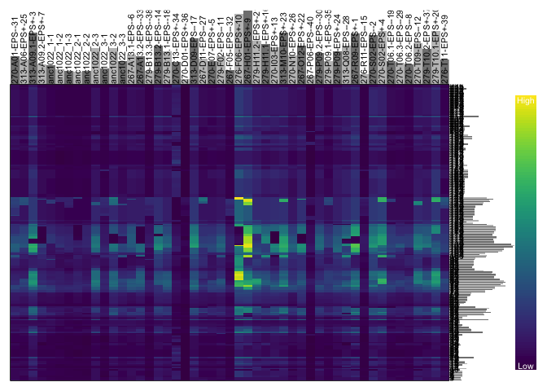<!-- -->

``` r
dp_pAcc <- extract.gt(chrom_pAcc, element="DP", as.numeric=TRUE)
rownames(dp_pAcc) <- 1:nrow(dp_pAcc)
head(dp_pAcc)
```

    ##   270-A01-EPS--31 313-A06-EPS+-25 313-A09.1-EPS+-3 313-A09.2-EPS+-7 anc1022_1-1
    ## 1              39              37               48               36          18
    ## 2              39              37               48               36          18
    ## 3              86              84              144               69          60
    ## 4              34             160              283              151          97
    ## 5              33             134              240              124          82
    ## 6              32              18               66               29          19
    ##   anc1022_1-2 anc1022_1-3 anc1022_2-1 anc1022_2-2 anc1022_2-3 anc1022_3-1
    ## 1          12          15          19          16          25          21
    ## 2          12          15          19          16          25          21
    ## 3          59          45          48          44          89          42
    ## 4         103          71          17          99         181         109
    ## 5          86          55          17          85         161          98
    ## 6          15           9          18          21          35          11
    ##   anc1022_3-2 anc1022_3-3 267-A13.1-EPS--6 267-A13.2-EPS--33 279-B13.3-EPS--38
    ## 1          48          32               37                42                23
    ## 2          48          32               37                42                23
    ## 3         126          91               76                81                49
    ## 4          37          30              167                31                92
    ## 5          37          29              146                33                74
    ## 6          30          30               32                34                 4
    ##   279-B13.2-EPS--14 279-B13.1-EPS--18 270-C13-EPS+-34 270-D01-EPS+-36
    ## 1                50                38              13               6
    ## 2                50                38              13               6
    ## 3               123                88              17              16
    ## 4                55               180              46              28
    ## 5                53               158              41              24
    ## 6                50                32              10               9
    ##   313-D09-EPS--17 267-D11-EPS--27 270-E07-EPS+-5 279-F02-EPS--11
    ## 1              50              45             33              42
    ## 2              50              45             33              42
    ## 3             112              88             77              86
    ## 4             232              47             26             135
    ## 5             217              46             26             124
    ## 6              41              28             15              25
    ##   267-F05-EPS--32 276-F06-EPS+-10 267-H01-EPS+-9 279-H11.2-EPS+-21
    ## 1              16              50             50                49
    ## 2              16              50             50                49
    ## 3              39             186            175               133
    ## 4              94              62            371                55
    ## 5              82              61            337                54
    ## 6              16              72             83                56
    ##   279-H11.1-EPS+-16 270-I03-EPS+-13 313-M10-EPS+-23 270-N10-EPS+-26
    ## 1                50              50              39              37
    ## 2                50              50              39              37
    ## 3               101              96             102              94
    ## 4               235              49              49             178
    ## 5               220              50              47             155
    ## 6                36              41              52              26
    ##   267-O12-EPS+-22 267-P06-EPS--40 279-P09.2-EPS--30 279-P09.1-EPS--35
    ## 1              50               8                38                30
    ## 2              50               8                38                30
    ## 3             118              33                92                70
    ## 4              52              58               184               127
    ## 5              53              43               158               110
    ## 6              71               9                28                20
    ##   279-P09-EPS+-24 313-Q08-EPS--28 267-R09-EPS+-1 276-R11-EPS--15 270-S02-EPS--2
    ## 1              50              50             50              14             49
    ## 2              50              50             50              14             51
    ## 3              88             118            130              20            135
    ## 4             189              45             63              52             65
    ## 5             159              43             60              47             66
    ## 6              32              45             45              10             66
    ##   270-S02-EPS+-4 270-T06.1-EPS--19 270-T06.3-EPS--29 270-T06.2-EPS--8
    ## 1             50                22                27               34
    ## 2             50                22                27               34
    ## 3            118                65                68               67
    ## 4            285               139               118              126
    ## 5            253               122               107              107
    ## 6             58                20                14               19
    ##   270-T09-EPS--12 279-T10.2-EPS+-37 279-T10.1-EPS+-20 276-T11-EPS+-39
    ## 1              42                32                50              22
    ## 2              42                32                50              22
    ## 3             143               104               138              59
    ## 4             272                47                59             123
    ## 5             241                45                57              97
    ## 6              38                34                44              25

``` r
heatmap.bp(dp_pAcc)
```

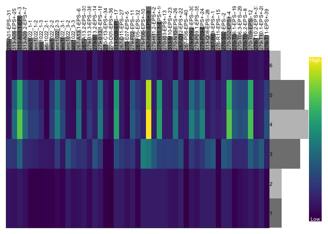<!-- -->

``` r
dp_pSymA <- extract.gt(chrom_pSymA, element="DP", as.numeric=TRUE)
rownames(dp_pSymA) <- 1:nrow(dp_pSymA)
head(dp_pSymA)
```

    ##   270-A01-EPS--31 313-A06-EPS+-25 313-A09.1-EPS+-3 313-A09.2-EPS+-7 anc1022_1-1
    ## 1              69              84              154               23          65
    ## 2              22              31               58               26          25
    ## 3              68              63              118               42          32
    ## 4             112              72              137               61          56
    ## 5              48              27               69               28          25
    ## 6              65              45               98               39          48
    ##   anc1022_1-2 anc1022_1-3 anc1022_2-1 anc1022_2-2 anc1022_2-3 anc1022_3-1
    ## 1          48          25          48          52         111          57
    ## 2          18          13          16          20          45          19
    ## 3          24          24          23          22          76          29
    ## 4          36          37          31          34          76          44
    ## 5          25          15          13          18          42          21
    ## 6          40          21          21          33          60          25
    ##   anc1022_3-2 anc1022_3-3 267-A13.1-EPS--6 267-A13.2-EPS--33 279-B13.3-EPS--38
    ## 1         146          74               99               110                50
    ## 2          50          26               33                47                20
    ## 3          85          62               50                61                37
    ## 4         132          87               66                96                52
    ## 5          42          34               54                50                28
    ## 6          61          45               69                73                28
    ##   279-B13.2-EPS--14 279-B13.1-EPS--18 270-C13-EPS+-34 270-D01-EPS+-36
    ## 1               148               127               6              11
    ## 2                47                46               8               3
    ## 3               109                77              13               0
    ## 4               149               114              19               3
    ## 5                52                46              14               5
    ## 6                79                83              27               8
    ##   313-D09-EPS--17 267-D11-EPS--27 270-E07-EPS+-5 279-F02-EPS--11
    ## 1             163              62             86             102
    ## 2              64              29             32              44
    ## 3              72              58             44              34
    ## 4             132              93             75              72
    ## 5              71              34             36              34
    ## 6             106              64             48              55
    ##   267-F05-EPS--32 276-F06-EPS+-10 267-H01-EPS+-9 279-H11.2-EPS+-21
    ## 1              41             230             46               149
    ## 2              13              84             52                59
    ## 3              26             160            147                 0
    ## 4              36             249            240               146
    ## 5              20             128            107                69
    ## 6              31             189            143                97
    ##   279-H11.1-EPS+-16 270-I03-EPS+-13 313-M10-EPS+-23 270-N10-EPS+-26
    ## 1               153             154             177              80
    ## 2                53              46              72              28
    ## 3               121              77             109              53
    ## 4               167             143             145             105
    ## 5                66              64              74              45
    ## 6                95             102             104              64
    ##   267-O12-EPS+-22 267-P06-EPS--40 279-P09.2-EPS--30 279-P09.1-EPS--35
    ## 1             138               6               101                52
    ## 2              58               8                37                25
    ## 3              93              13                51                69
    ## 4             115              17               104                79
    ## 5              61              21                46                40
    ## 6              79              27                75                48
    ##   279-P09-EPS+-24 313-Q08-EPS--28 267-R09-EPS+-1 276-R11-EPS--15 270-S02-EPS--2
    ## 1             108             149            208               8            187
    ## 2              46              50             60              10             77
    ## 3              63              17            105              19             91
    ## 4             101             156            174              30            176
    ## 5              25              66             88              11             84
    ## 6              51              94            101              16            102
    ##   270-S02-EPS+-4 270-T06.1-EPS--19 270-T06.3-EPS--29 270-T06.2-EPS--8
    ## 1            162                60                75               14
    ## 2             49                20                28               18
    ## 3             88                63                50               30
    ## 4            166                73                70               75
    ## 5             55                26                34               24
    ## 6             98                46                53               28
    ##   270-T09-EPS--12 279-T10.2-EPS+-37 279-T10.1-EPS+-20 276-T11-EPS+-39
    ## 1              40               112               169              84
    ## 2              40                44                59              28
    ## 3              60                64               102              45
    ## 4             112               117               191              79
    ## 5              52                43                85              23
    ## 6             102                80               115              38

``` r
heatmap.bp(dp_pSymA)
```

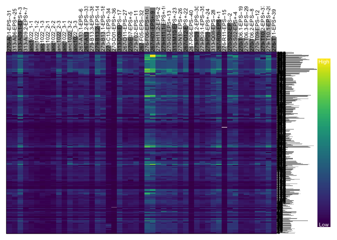<!-- -->

``` r
dp_pSymB <- extract.gt(chrom_pSymB, element="DP", as.numeric=TRUE)
rownames(dp_pSymB) <- 1:nrow(dp_pSymB)
head(dp_pSymB)
```

    ##   270-A01-EPS--31 313-A06-EPS+-25 313-A09.1-EPS+-3 313-A09.2-EPS+-7 anc1022_1-1
    ## 1              57              35              122               44          39
    ## 2              57              35              122               44          39
    ## 3              59              61              124               53          60
    ## 4              58              58              123               52          59
    ## 5              56              61              125               56          62
    ## 6              57              65              136               63          65
    ##   anc1022_1-2 anc1022_1-3 anc1022_2-1 anc1022_2-2 anc1022_2-3 anc1022_3-1
    ## 1          30          28          17          24          63          25
    ## 2          30          28          17          24          63          25
    ## 3          32          23          35          31          80          37
    ## 4          32          24          34          31          79          37
    ## 5          31          25          35          36          80          37
    ## 6          35          25          37          37          86          41
    ##   anc1022_3-2 anc1022_3-3 267-A13.1-EPS--6 267-A13.2-EPS--33 279-B13.3-EPS--38
    ## 1          72          55               65                62                19
    ## 2          72          55               65                62                19
    ## 3          80          61               73                87                28
    ## 4          80          61               72                85                29
    ## 5          84          62               79                93                29
    ## 6          86          65               85                95                28
    ##   279-B13.2-EPS--14 279-B13.1-EPS--18 270-C13-EPS+-34 270-D01-EPS+-36
    ## 1                72                75              67               3
    ## 2                72                75              70               3
    ## 3                94                81              27              10
    ## 4                92                81              26              10
    ## 5               100                85              29              14
    ## 6               103                88              29              15
    ##   313-D09-EPS--17 267-D11-EPS--27 270-E07-EPS+-5 279-F02-EPS--11
    ## 1              92              42             42              41
    ## 2              92              42             42              41
    ## 3             108              64             52              66
    ## 4             107              65             51              65
    ## 5             107              66             55              72
    ## 6             112              69             57              78
    ##   267-F05-EPS--32 276-F06-EPS+-10 267-H01-EPS+-9 279-H11.2-EPS+-21
    ## 1              22             175            150               112
    ## 2              22             175            150               112
    ## 3              34             201            167               146
    ## 4              34             205            166               148
    ## 5              35             198            181               157
    ## 6              40             200            192               167
    ##   279-H11.1-EPS+-16 270-I03-EPS+-13 313-M10-EPS+-23 270-N10-EPS+-26
    ## 1                88              94             110              62
    ## 2                88              94             110              62
    ## 3                96             100             113              72
    ## 4                95             100             111              71
    ## 5               100             109             128              76
    ## 6               106             118             131              79
    ##   267-O12-EPS+-22 267-P06-EPS--40 279-P09.2-EPS--30 279-P09.1-EPS--35
    ## 1              96               9                75                36
    ## 2              96               9                75                36
    ## 3              77              28                62                48
    ## 4              77              28                63                48
    ## 5              77              30                71                50
    ## 6              81              31                74                55
    ##   279-P09-EPS+-24 313-Q08-EPS--28 267-R09-EPS+-1 276-R11-EPS--15 270-S02-EPS--2
    ## 1              65             110            137              18            104
    ## 2              65             110            137              18            104
    ## 3              68             130            135              21            113
    ## 4              68             129            136              21            113
    ## 5              68             132            147              21            122
    ## 6              72             139            158              24            128
    ##   270-S02-EPS+-4 270-T06.1-EPS--19 270-T06.3-EPS--29 270-T06.2-EPS--8
    ## 1            120                47                39               43
    ## 2            120                47                39               43
    ## 3            107                41                42               50
    ## 4            106                40                40               49
    ## 5            115                43                44               49
    ## 6            121                47                52               50
    ##   270-T09-EPS--12 279-T10.2-EPS+-37 279-T10.1-EPS+-20 276-T11-EPS+-39
    ## 1              78                65               111              42
    ## 2              78                65               111              42
    ## 3              97                74               139              51
    ## 4              99                73               136              51
    ## 5              98                76               144              58
    ## 6             101                76               154              60

``` r
heatmap.bp(dp_pSymB)
```

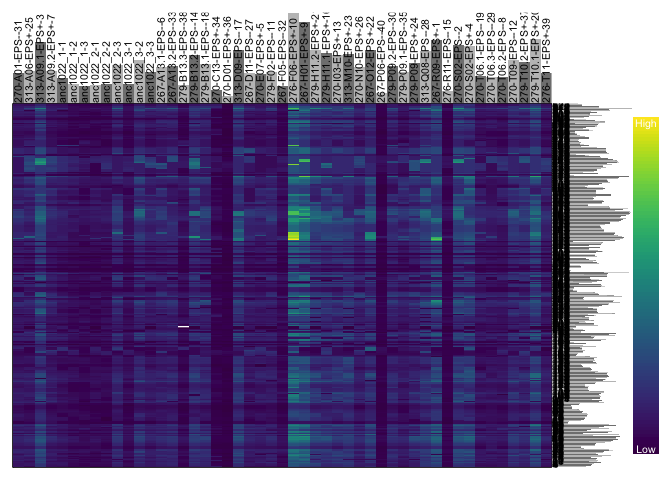<!-- -->

``` r
# visualizing read depth per sample, boxplot
par(mar=c(8,4,1,1))
#boxplot(dp, las=3, col=c("#C0C0C0", "#808080"), ylab="Depth", log='y', las=2)
boxplot(dp_chrom, las=3, col=c("#C0C0C0", "#808080"), ylab="Depth", las=2)
```

    ## Warning in bxp(list(stats = structure(c(11, 34, 44.5, 87, 164, 12, 30, 38, :
    ## Duplicated argument las = 2 is disregarded

``` r
abline(h=seq(0,1e4, by=100), col="#C0C0C088")
```

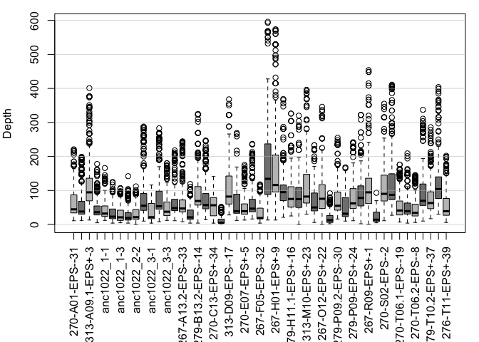<!-- -->

``` r
par(mar=c(8,4,1,1))
#boxplot(dp, las=3, col=c("#C0C0C0", "#808080"), ylab="Depth", log='y', las=2)
boxplot(dp_pAcc, las=3, col=c("#C0C0C0", "#808080"), ylab="Depth", las=2)
```

    ## Warning in bxp(list(stats = structure(c(32, 33, 36.5, 39, 39, 18, 37, 60.5, :
    ## Duplicated argument las = 2 is disregarded

``` r
abline(h=seq(0,1e4, by=100), col="#C0C0C088")
```

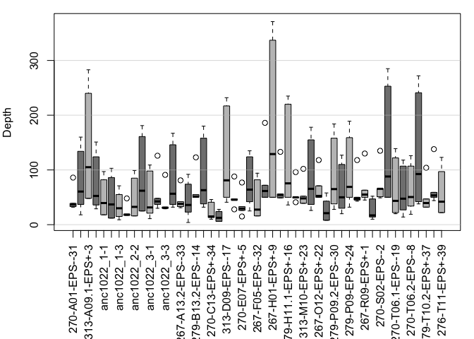<!-- -->

``` r
par(mar=c(8,4,1,1))
#boxplot(dp, las=3, col=c("#C0C0C0", "#808080"), ylab="Depth", log='y', las=2)
boxplot(dp_pSymA, las=3, col=c("#C0C0C0", "#808080"), ylab="Depth", las=2)
```

    ## Warning in bxp(list(stats = structure(c(6, 45, 63, 80, 132, 7, 43, 62, 91, :
    ## Duplicated argument las = 2 is disregarded

``` r
abline(h=seq(0,1e4, by=100), col="#C0C0C088")
```

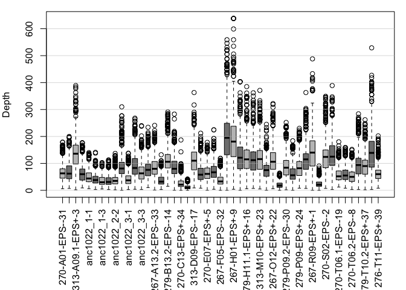<!-- -->

``` r
par(mar=c(8,4,1,1))
#boxplot(dp, las=3, col=c("#C0C0C0", "#808080"), ylab="Depth", log='y', las=2)
boxplot(dp_pSymB, las=3, col=c("#C0C0C0", "#808080"), ylab="Depth", las=2)
```

    ## Warning in bxp(list(stats = structure(c(2, 51, 64, 85, 135, 4, 48, 66, 91, :
    ## Duplicated argument las = 2 is disregarded

``` r
abline(h=seq(0,1e4, by=100), col="#C0C0C088")
```

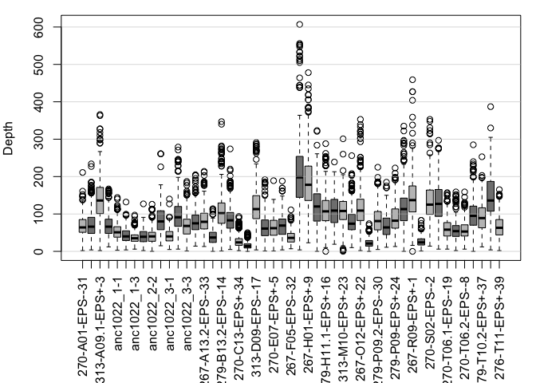<!-- -->

## 363 SNPs used in GWAS

### Summary statistics of vcf

First, on server, subset full vcf into the four genomic regions
(chromosome, accessory plasmid A, pSymA, pSymB).

``` bash
# on server:
$VCFTOOLS --vcf  KH35c_GEMMA.recode.vcf --chr CP021825.1 --recode --recode-INFO-all --out KH35c_gwas_chrom
## 34 SNPs kept

$VCFTOOLS --vcf  KH35c_GEMMA.recode.vcf --chr CP021826.1 --recode --recode-INFO-all --out KH35c_gwas_pAccA
## 2 SNPs kept

$VCFTOOLS --vcf  KH35c_GEMMA.recode.vcf --chr CP021827.1 --recode --recode-INFO-all --out KH35c_gwas_pSymA
## 184 SNPs kept

$VCFTOOLS --vcf  KH35c_GEMMA.recode.vcf --chr CP021828.1 --recode --recode-INFO-all --out KH35c_gwas_pSymB
## 143 SNPs kept

## zipped on server, scp'ed to my comp. 
```

## Construct the chrom objects

``` r
# vcf's
vcf_chrom <- read.vcfR("./Data/KH35c_gwas_regions/KH35c_gwas_chrom.recode.vcf")
```

    ## Scanning file to determine attributes.
    ## File attributes:
    ##   meta lines: 39
    ##   header_line: 40
    ##   variant count: 34
    ##   column count: 58
    ## Meta line 39 read in.
    ## All meta lines processed.
    ## gt matrix initialized.
    ## Character matrix gt created.
    ##   Character matrix gt rows: 34
    ##   Character matrix gt cols: 58
    ##   skip: 0
    ##   nrows: 34
    ##   row_num: 0
    ## Processed variant: 34
    ## All variants processed

``` r
vcf_pAcc <- read.vcfR("./Data/KH35c_gwas_regions/KH35c_gwas_pAccA.recode.vcf")
```

    ## Scanning file to determine attributes.
    ## File attributes:
    ##   meta lines: 39
    ##   header_line: 40
    ##   variant count: 2
    ##   column count: 58
    ## Meta line 39 read in.
    ## All meta lines processed.
    ## gt matrix initialized.
    ## Character matrix gt created.
    ##   Character matrix gt rows: 2
    ##   Character matrix gt cols: 58
    ##   skip: 0
    ##   nrows: 2
    ##   row_num: 0
    ## Processed variant: 2
    ## All variants processed

``` r
vcf_pSymA <- read.vcfR("./Data/KH35c_gwas_regions/KH35c_gwas_pSymA.recode.vcf")
```

    ## Scanning file to determine attributes.
    ## File attributes:
    ##   meta lines: 39
    ##   header_line: 40
    ##   variant count: 184
    ##   column count: 58
    ## Meta line 39 read in.
    ## All meta lines processed.
    ## gt matrix initialized.
    ## Character matrix gt created.
    ##   Character matrix gt rows: 184
    ##   Character matrix gt cols: 58
    ##   skip: 0
    ##   nrows: 184
    ##   row_num: 0
    ## Processed variant: 184
    ## All variants processed

``` r
vcf_pSymB <- read.vcfR("./Data/KH35c_gwas_regions/KH35c_gwas_pSymB.recode.vcf")
```

    ## Scanning file to determine attributes.
    ## File attributes:
    ##   meta lines: 39
    ##   header_line: 40
    ##   variant count: 143
    ##   column count: 58
    ## Meta line 39 read in.
    ## All meta lines processed.
    ## gt matrix initialized.
    ## Character matrix gt created.
    ##   Character matrix gt rows: 143
    ##   Character matrix gt cols: 58
    ##   skip: 0
    ##   nrows: 143
    ##   row_num: 0
    ## Processed variant: 143
    ## All variants processed

``` r
# create chrom objects
chrom <- create.chromR(name='Chromosome', vcf=vcf_chrom, seq=ref_chrom, ann=gff_chrom)
```

    ## Names in vcf:

    ##   CP021825.1

    ## Names of sequences:

    ##   Chromosome

    ## Warning in create.chromR(name = "Chromosome", vcf = vcf_chrom, seq = ref_chrom, : 
    ##         Names in variant data and sequence data do not match perfectly.
    ##         If you choose to proceed, we'll do our best to match the data.
    ##         But prepare yourself for unexpected results.

    ## Initializing var.info slot.

    ## var.info slot initialized.

``` r
chrom_pAcc <- create.chromR(name='Accessory_plasmid', vcf=vcf_pAcc, seq=ref_pAcc, ann=gff_pAcc)
```

    ## Names in vcf:

    ##   CP021826.1

    ## Names of sequences:

    ##   Accessory_plasmid

    ## Warning in create.chromR(name = "Accessory_plasmid", vcf = vcf_pAcc, seq = ref_pAcc, : 
    ##         Names in variant data and sequence data do not match perfectly.
    ##         If you choose to proceed, we'll do our best to match the data.
    ##         But prepare yourself for unexpected results.

    ## Initializing var.info slot.

    ## var.info slot initialized.

``` r
chrom_pSymA <- create.chromR(name='Symbiosis_plasmid_A', vcf=vcf_pSymA, seq=ref_pSymA, ann=gff_pSymA)
```

    ## Names in vcf:

    ##   CP021827.1

    ## Names of sequences:

    ##   Symbiosis_plasmid_A

    ## Warning in create.chromR(name = "Symbiosis_plasmid_A", vcf = vcf_pSymA, : 
    ##         Names in variant data and sequence data do not match perfectly.
    ##         If you choose to proceed, we'll do our best to match the data.
    ##         But prepare yourself for unexpected results.

    ## Initializing var.info slot.

    ## var.info slot initialized.

``` r
chrom_pSymB <- create.chromR(name='Symbiosis_plasmid_B', vcf=vcf_pSymB, seq=ref_pSymB, ann=gff_pSymB)
```

    ## Names in vcf:

    ##   CP021828.1

    ## Names of sequences:

    ##   Symbiosis_plasmid_B

    ## Warning in create.chromR(name = "Symbiosis_plasmid_B", vcf = vcf_pSymB, : 
    ##         Names in variant data and sequence data do not match perfectly.
    ##         If you choose to proceed, we'll do our best to match the data.
    ##         But prepare yourself for unexpected results.

    ## Initializing var.info slot.

    ## var.info slot initialized.

``` r
chrom <- proc.chromR(chrom, verbose=FALSE, win.size = 100)
chrom_pAcc <- proc.chromR(chrom_pAcc, verbose=FALSE, win.size = 100)
chrom_pSymA <- proc.chromR(chrom_pSymA, verbose=FALSE, win.size = 100)
chrom_pSymB <- proc.chromR(chrom_pSymB, verbose=FALSE, win.size = 100)

chromoqc(chrom, dp.alpha=20)
```

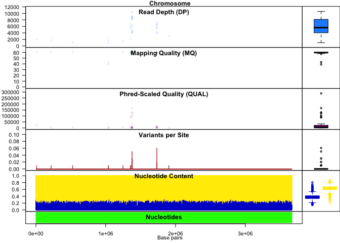<!-- -->

``` r
chromoqc(chrom_pAcc, dp.alpha=20)
```

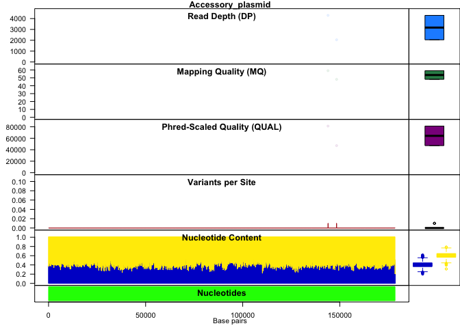<!-- -->

``` r
chromoqc(chrom_pSymA, dp.alpha=20)
```

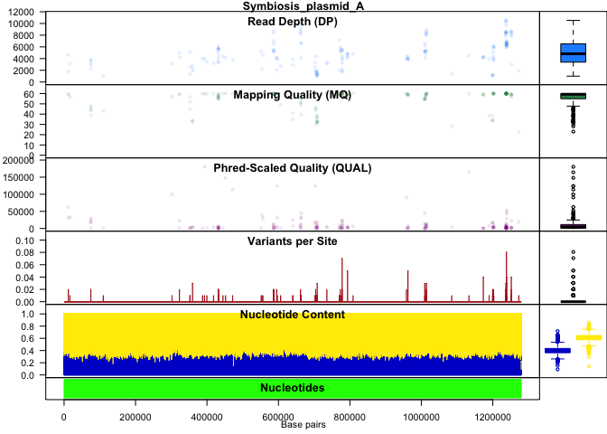<!-- -->

``` r
chromoqc(chrom_pSymB, dp.alpha=20)
```

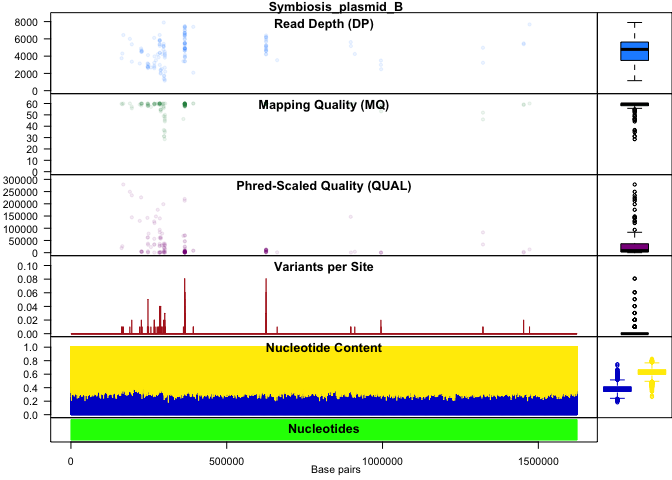<!-- -->

``` r
plot(chrom)
```

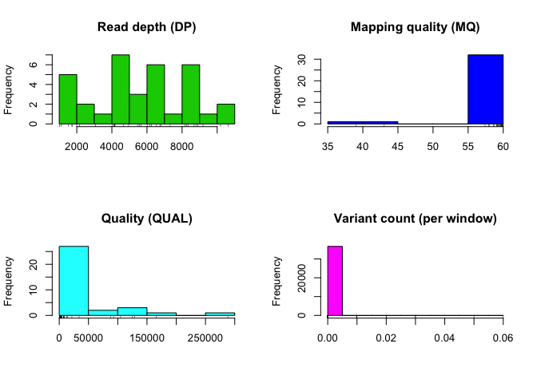<!-- -->

``` r
plot(chrom_pAcc)
```

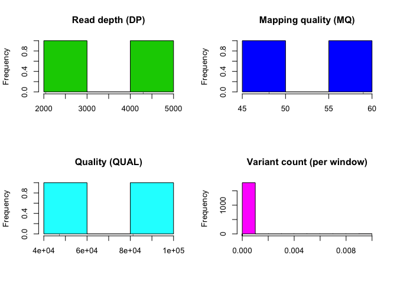<!-- -->

``` r
plot(chrom_pSymA)
```

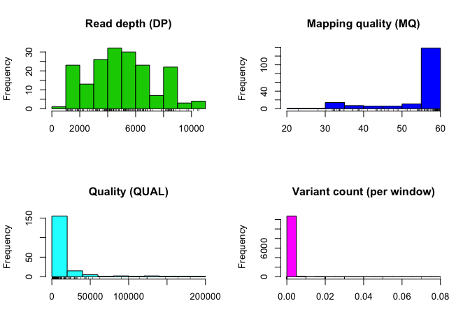<!-- -->

``` r
plot(chrom_pSymB)
```

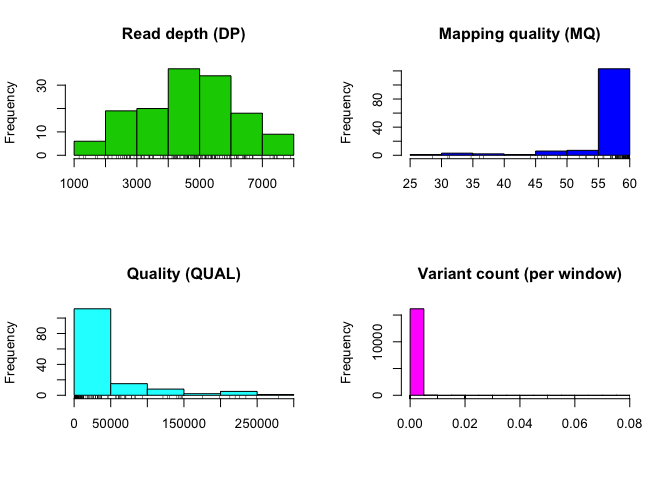<!-- -->

``` r
# Summarize per sample

# extract genotype
dp_chrom <- extract.gt(chrom, element="DP", as.numeric=TRUE)
rownames(dp_chrom) <- 1:nrow(dp_chrom)
head(dp_chrom)
```

    ##   270-A01-EPS--31 313-A06-EPS+-25 313-A09.1-EPS+-3 313-A09.2-EPS+-7 anc1022_1-1
    ## 1              48              26               51               34          23
    ## 2              31              33               31               31          23
    ## 3              27              15               47               18          12
    ## 4              35              23               54                5          15
    ## 5              11              17               54                5          14
    ## 6              22              16               65               23          18
    ##   anc1022_1-2 anc1022_1-3 anc1022_2-1 anc1022_2-2 anc1022_2-3 anc1022_3-1
    ## 1          17          12          13          13          47          19
    ## 2          21          17           9          11          42          19
    ## 3           8           7           7          11          23          10
    ## 4          23          14           7           4          33          22
    ## 5           9          12           7           4          12          17
    ## 6          10           7          13           9          14          10
    ##   anc1022_3-2 anc1022_3-3 267-A13.1-EPS--6 267-A13.2-EPS--33 279-B13.3-EPS--38
    ## 1          51          33               37                71                19
    ## 2           8          40               45                51                19
    ## 3          18          12               11                17                 6
    ## 4          53          41               20                39                16
    ## 5          28          23               20                22                 7
    ## 6          40          22               26                23                11
    ##   279-B13.2-EPS--14 279-B13.1-EPS--18 270-C13-EPS+-34 270-D01-EPS+-36
    ## 1                68                46              17               4
    ## 2                65                53              12               5
    ## 3                30                30               4               4
    ## 4                44                52               7               5
    ## 5                45                16               7               5
    ## 6                42                46               7               4
    ##   313-D09-EPS--17 267-D11-EPS--27 270-E07-EPS+-5 279-F02-EPS--11
    ## 1              47              61             33              28
    ## 2              94              33             30              44
    ## 3              28              14             18              16
    ## 4              37              34             31              49
    ## 5              37              28             21              24
    ## 6              46              21             25             116
    ##   267-F05-EPS--32 276-F06-EPS+-10 267-H01-EPS+-9 279-H11.2-EPS+-21
    ## 1              30              50             51                50
    ## 2              20              25             13                86
    ## 3               7              51             43                33
    ## 4              14              90            100                54
    ## 5               7              39             55                21
    ## 6              10              70             75                40
    ##   279-H11.1-EPS+-16 270-I03-EPS+-13 313-M10-EPS+-23 270-N10-EPS+-26
    ## 1                48              50              51              35
    ## 2                61              18              67               6
    ## 3                27              25              40              12
    ## 4                85              43              31              39
    ## 5                39              43              31              25
    ## 6                25              51              47              23
    ##   267-O12-EPS+-22 267-P06-EPS--40 279-P09.2-EPS--30 279-P09.1-EPS--35
    ## 1              50              17                38                23
    ## 2              46               9                79                29
    ## 3              21               5                23                11
    ## 4              40               7                18                25
    ## 5              40               2                18                17
    ## 6              47               3                19                28
    ##   279-P09-EPS+-24 313-Q08-EPS--28 267-R09-EPS+-1 276-R11-EPS--15 270-S02-EPS--2
    ## 1              42              46             50              10             87
    ## 2              47              55             23              12             11
    ## 3              25             129             43               5             42
    ## 4              33               3            106               7             67
    ## 5              11               3             14               7             33
    ## 6              34              43             68               7             65
    ##   270-S02-EPS+-4 270-T06.1-EPS--19 270-T06.3-EPS--29 270-T06.2-EPS--8
    ## 1             50                39                35               33
    ## 2             65                36                33               28
    ## 3             34                15                12               11
    ## 4             65                20                47               37
    ## 5             32                10                 4               21
    ## 6             56                18                15               19
    ##   270-T09-EPS--12 279-T10.2-EPS+-37 279-T10.1-EPS+-20 276-T11-EPS+-39
    ## 1              68                42                50              41
    ## 2              10                52                94              35
    ## 3              26                22                39               9
    ## 4              39                17                40              32
    ## 5              26                17                40               6
    ## 6              32                19                56              18

``` r
heatmap.bp(dp_chrom)
```

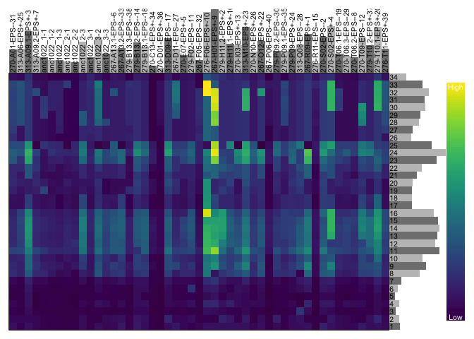<!-- -->

``` r
dp_pAcc <- extract.gt(chrom_pAcc, element="DP", as.numeric=TRUE)
rownames(dp_pAcc) <- 1:nrow(dp_pAcc)
head(dp_pAcc)
```

    ##   270-A01-EPS--31 313-A06-EPS+-25 313-A09.1-EPS+-3 313-A09.2-EPS+-7 anc1022_1-1
    ## 1              86              84              144               69          60
    ## 2              32              18               66               29          19
    ##   anc1022_1-2 anc1022_1-3 anc1022_2-1 anc1022_2-2 anc1022_2-3 anc1022_3-1
    ## 1          59          45          48          44          89          42
    ## 2          15           9          18          21          35          11
    ##   anc1022_3-2 anc1022_3-3 267-A13.1-EPS--6 267-A13.2-EPS--33 279-B13.3-EPS--38
    ## 1         126          91               76                81                49
    ## 2          30          30               32                34                 4
    ##   279-B13.2-EPS--14 279-B13.1-EPS--18 270-C13-EPS+-34 270-D01-EPS+-36
    ## 1               123                88              17              16
    ## 2                50                32              10               9
    ##   313-D09-EPS--17 267-D11-EPS--27 270-E07-EPS+-5 279-F02-EPS--11
    ## 1             112              88             77              86
    ## 2              41              28             15              25
    ##   267-F05-EPS--32 276-F06-EPS+-10 267-H01-EPS+-9 279-H11.2-EPS+-21
    ## 1              39             186            175               133
    ## 2              16              72             83                56
    ##   279-H11.1-EPS+-16 270-I03-EPS+-13 313-M10-EPS+-23 270-N10-EPS+-26
    ## 1               101              96             102              94
    ## 2                36              41              52              26
    ##   267-O12-EPS+-22 267-P06-EPS--40 279-P09.2-EPS--30 279-P09.1-EPS--35
    ## 1             118              33                92                70
    ## 2              71               9                28                20
    ##   279-P09-EPS+-24 313-Q08-EPS--28 267-R09-EPS+-1 276-R11-EPS--15 270-S02-EPS--2
    ## 1              88             118            130              20            135
    ## 2              32              45             45              10             66
    ##   270-S02-EPS+-4 270-T06.1-EPS--19 270-T06.3-EPS--29 270-T06.2-EPS--8
    ## 1            118                65                68               67
    ## 2             58                20                14               19
    ##   270-T09-EPS--12 279-T10.2-EPS+-37 279-T10.1-EPS+-20 276-T11-EPS+-39
    ## 1             143               104               138              59
    ## 2              38                34                44              25

``` r
heatmap.bp(dp_pAcc)
```

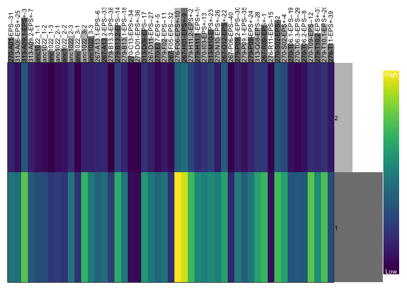<!-- -->

``` r
dp_pSymA <- extract.gt(chrom_pSymA, element="DP", as.numeric=TRUE)
rownames(dp_pSymA) <- 1:nrow(dp_pSymA)
head(dp_pSymA)
```

    ##   270-A01-EPS--31 313-A06-EPS+-25 313-A09.1-EPS+-3 313-A09.2-EPS+-7 anc1022_1-1
    ## 1              69              84              154               23          65
    ## 2              22              31               58               26          25
    ## 3              68              63              118               42          32
    ## 4              48              27               69               28          25
    ## 5              65              45               98               39          48
    ## 6              75              52              119               50          53
    ##   anc1022_1-2 anc1022_1-3 anc1022_2-1 anc1022_2-2 anc1022_2-3 anc1022_3-1
    ## 1          48          25          48          52         111          57
    ## 2          18          13          16          20          45          19
    ## 3          24          24          23          22          76          29
    ## 4          25          15          13          18          42          21
    ## 5          40          21          21          33          60          25
    ## 6          39          26          27          36          81          34
    ##   anc1022_3-2 anc1022_3-3 267-A13.1-EPS--6 267-A13.2-EPS--33 279-B13.3-EPS--38
    ## 1         146          74               99               110                50
    ## 2          50          26               33                47                20
    ## 3          85          62               50                61                37
    ## 4          42          34               54                50                28
    ## 5          61          45               69                73                28
    ## 6          68          49               80                79                27
    ##   279-B13.2-EPS--14 279-B13.1-EPS--18 270-C13-EPS+-34 270-D01-EPS+-36
    ## 1               148               127               6              11
    ## 2                47                46               8               3
    ## 3               109                77              13               0
    ## 4                52                46              14               5
    ## 5                79                83              27               8
    ## 6                90                89              30              11
    ##   313-D09-EPS--17 267-D11-EPS--27 270-E07-EPS+-5 279-F02-EPS--11
    ## 1             163              62             86             102
    ## 2              64              29             32              44
    ## 3              72              58             44              34
    ## 4              71              34             36              34
    ## 5             106              64             48              55
    ## 6             126              74             58              54
    ##   267-F05-EPS--32 276-F06-EPS+-10 267-H01-EPS+-9 279-H11.2-EPS+-21
    ## 1              41             230             46               149
    ## 2              13              84             52                59
    ## 3              26             160            147                 0
    ## 4              20             128            107                69
    ## 5              31             189            143                97
    ## 6              30             221            191               109
    ##   279-H11.1-EPS+-16 270-I03-EPS+-13 313-M10-EPS+-23 270-N10-EPS+-26
    ## 1               153             154             177              80
    ## 2                53              46              72              28
    ## 3               121              77             109              53
    ## 4                66              64              74              45
    ## 5                95             102             104              64
    ## 6               110             120             114              71
    ##   267-O12-EPS+-22 267-P06-EPS--40 279-P09.2-EPS--30 279-P09.1-EPS--35
    ## 1             138               6               101                52
    ## 2              58               8                37                25
    ## 3              93              13                51                69
    ## 4              61              21                46                40
    ## 5              79              27                75                48
    ## 6              80              31                73                47
    ##   279-P09-EPS+-24 313-Q08-EPS--28 267-R09-EPS+-1 276-R11-EPS--15 270-S02-EPS--2
    ## 1             108             149            208               8            187
    ## 2              46              50             60              10             77
    ## 3              63              17            105              19             91
    ## 4              25              66             88              11             84
    ## 5              51              94            101              16            102
    ## 6              69             127            113              19            126
    ##   270-S02-EPS+-4 270-T06.1-EPS--19 270-T06.3-EPS--29 270-T06.2-EPS--8
    ## 1            162                60                75               14
    ## 2             49                20                28               18
    ## 3             88                63                50               30
    ## 4             55                26                34               24
    ## 5             98                46                53               28
    ## 6            116                47                62               40
    ##   270-T09-EPS--12 279-T10.2-EPS+-37 279-T10.1-EPS+-20 276-T11-EPS+-39
    ## 1              40               112               169              84
    ## 2              40                44                59              28
    ## 3              60                64               102              45
    ## 4              52                43                85              23
    ## 5             102                80               115              38
    ## 6             118               100               139              48

``` r
heatmap.bp(dp_pSymA)
```

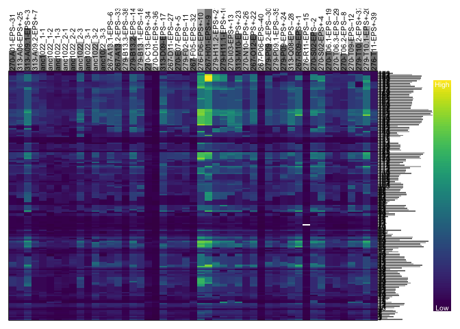<!-- -->

``` r
dp_pSymB <- extract.gt(chrom_pSymB, element="DP", as.numeric=TRUE)
rownames(dp_pSymB) <- 1:nrow(dp_pSymB)
head(dp_pSymB)
```

    ##   270-A01-EPS--31 313-A06-EPS+-25 313-A09.1-EPS+-3 313-A09.2-EPS+-7 anc1022_1-1
    ## 1              79              49              122               51          38
    ## 2              68              77              152               79          36
    ## 3              88             101              189              121          69
    ## 4             106             131              181               83          61
    ## 5              58              59              100               52          39
    ## 6              82              91              143               90          63
    ##   anc1022_1-2 anc1022_1-3 anc1022_2-1 anc1022_2-2 anc1022_2-3 anc1022_3-1
    ## 1          20          39          28          41          87          43
    ## 2          18          33          17          17          86          45
    ## 3          64          44          55          53         145          59
    ## 4          42          44          44          44         150          68
    ## 5          28          53          30          30          63          38
    ## 6          49          75          47          48         110          64
    ##   anc1022_3-2 anc1022_3-3 267-A13.1-EPS--6 267-A13.2-EPS--33 279-B13.3-EPS--38
    ## 1          87          81               78                82                25
    ## 2          85          83               84                88                34
    ## 3         175         106              124               139                60
    ## 4         150         101               98               110                54
    ## 5          70          60               62                67                25
    ## 6         123          88              101               109                49
    ##   279-B13.2-EPS--14 279-B13.1-EPS--18 270-C13-EPS+-34 270-D01-EPS+-36
    ## 1               113                74              17               7
    ## 2                88               105               8               4
    ## 3               146               153              30              23
    ## 4               176               144              40              23
    ## 5               108                64              34              18
    ## 6               163               109              44              19
    ##   313-D09-EPS--17 267-D11-EPS--27 270-E07-EPS+-5 279-F02-EPS--11
    ## 1             147              52             56              62
    ## 2             175              70             37              36
    ## 3             207              94             97             116
    ## 4             175             124             98             102
    ## 5             104              67             67              40
    ## 6             164             114            101              76
    ##   267-F05-EPS--32 276-F06-EPS+-10 267-H01-EPS+-9 279-H11.2-EPS+-21
    ## 1              32             208            181               135
    ## 2              47             202            196               142
    ## 3              56             308            331               213
    ## 4              69             311            329               183
    ## 5              42             167            136               105
    ## 6              59             265            217               168
    ##   279-H11.1-EPS+-16 270-I03-EPS+-13 313-M10-EPS+-23 270-N10-EPS+-26
    ## 1               110             116              94              66
    ## 2               121             143             133              64
    ## 3               207             153             165             105
    ## 4               169             163             204             138
    ## 5               100              84              90              59
    ## 6               164             145             148              94
    ##   267-O12-EPS+-22 267-P06-EPS--40 279-P09.2-EPS--30 279-P09.1-EPS--35
    ## 1             105              15                87                45
    ## 2             127              20                85                71
    ## 3             160              37               137               101
    ## 4               4              20               129                89
    ## 5              95              31                92                45
    ## 6             154              50               137                92
    ##   279-P09-EPS+-24 313-Q08-EPS--28 267-R09-EPS+-1 276-R11-EPS--15 270-S02-EPS--2
    ## 1             104             124            153              13            128
    ## 2             115             124            180              27            152
    ## 3             198             189            230              28            224
    ## 4             130             180            236               1            186
    ## 5              63             117            137              19            101
    ## 6             101             159            212              42            169
    ##   270-S02-EPS+-4 270-T06.1-EPS--19 270-T06.3-EPS--29 270-T06.2-EPS--8
    ## 1              8                50                51               41
    ## 2            134                61                36               42
    ## 3            248               107                83               74
    ## 4            221                76                80               83
    ## 5            100                30                46               86
    ## 6            151                60                62              109
    ##   270-T09-EPS--12 279-T10.2-EPS+-37 279-T10.1-EPS+-20 276-T11-EPS+-39
    ## 1             107                84               172              46
    ## 2              89                98               157              43
    ## 3             146               112               242             102
    ## 4             166               143               247              82
    ## 5              58                66               107              46
    ## 6             112               113               188              75

``` r
heatmap.bp(dp_pSymB)
```

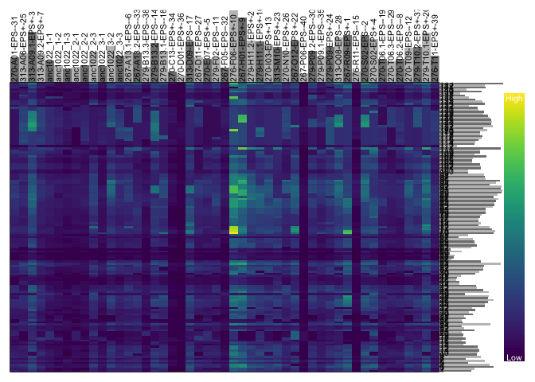<!-- -->

``` r
# visualizing read depth per sample, boxplot
par(mar=c(8,4,1,1))
#boxplot(dp, las=3, col=c("#C0C0C0", "#808080"), ylab="Depth", log='y', las=2)
boxplot(dp_chrom, las=3, col=c("#C0C0C0", "#808080"), ylab="Depth", las=2)
```

    ## Warning in bxp(list(stats = structure(c(11, 48, 101.5, 154, 221, 15, 46, :
    ## Duplicated argument las = 2 is disregarded

``` r
abline(h=seq(0,1e4, by=100), col="#C0C0C088")
```

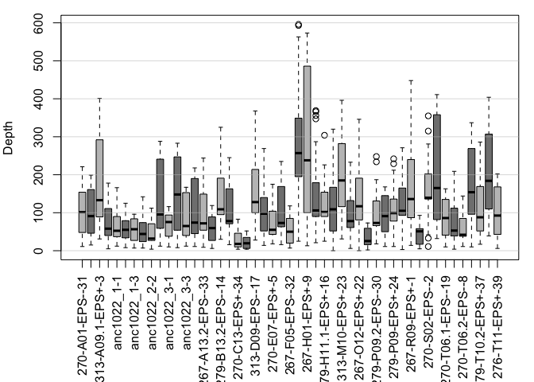<!-- -->

``` r
par(mar=c(8,4,1,1))
#boxplot(dp, las=3, col=c("#C0C0C0", "#808080"), ylab="Depth", log='y', las=2)
boxplot(dp_pAcc, las=3, col=c("#C0C0C0", "#808080"), ylab="Depth", las=2)
```

    ## Warning in bxp(list(stats = structure(c(32, 32, 59, 86, 86, 18, 18, 51, :
    ## Duplicated argument las = 2 is disregarded

``` r
abline(h=seq(0,1e4, by=100), col="#C0C0C088")
```

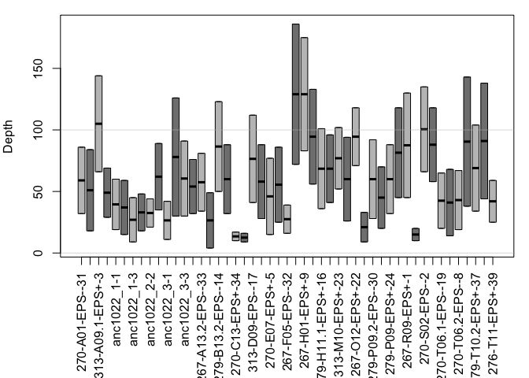<!-- -->

``` r
par(mar=c(8,4,1,1))
#boxplot(dp, las=3, col=c("#C0C0C0", "#808080"), ylab="Depth", log='y', las=2)
boxplot(dp_pSymA, las=3, col=c("#C0C0C0", "#808080"), ylab="Depth", las=2)
```

    ## Warning in bxp(list(stats = structure(c(6, 44.5, 74, 113, 179, 7, 47.5, :
    ## Duplicated argument las = 2 is disregarded

``` r
abline(h=seq(0,1e4, by=100), col="#C0C0C088")
```

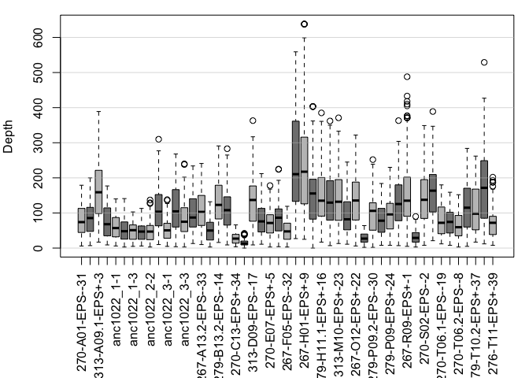<!-- -->

``` r
par(mar=c(8,4,1,1))
#boxplot(dp, las=3, col=c("#C0C0C0", "#808080"), ylab="Depth", log='y', las=2)
boxplot(dp_pSymB, las=3, col=c("#C0C0C0", "#808080"), ylab="Depth", las=2)
```

    ## Warning in bxp(list(stats = structure(c(14, 58.5, 70, 98, 148, 12, 62, 82, :
    ## Duplicated argument las = 2 is disregarded

``` r
abline(h=seq(0,1e4, by=100), col="#C0C0C088")
```

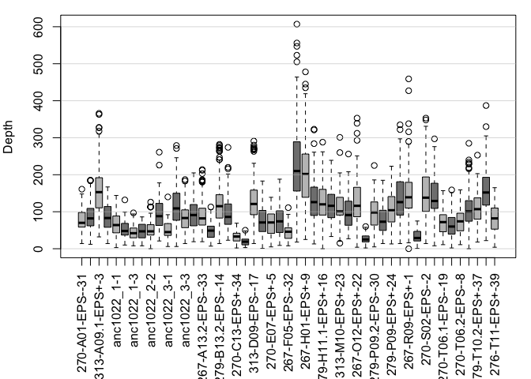<!-- -->

# Add relevant info to vcf summary files

Two files: \* filt1\_1330.recode.vcf (1330 sites) \*
GEMMA\_363.recode.vcf (363 sites)

Info to add: \* SnpEff annotations \* NCBI annotations (GEMMA\_363 only)
\* Minor allele (maf) \* Evolutionary origin \* maf for each line of
origin

## Annotate VCFs using SnpEff (build database)

First, need to build database in SnpEff:

``` bash
wget http://sourceforge.net/projects/snpeff/files/snpEff_latest_core.zip
# unzip
cd SnpEff

# check to see what genomes are already in the database:
java -jar snpEff.jar databases | grep -i Sinorhizobium_meliloti
# found 1021, but not KH35c. Had to build my own...

# build database using GFF (GTF preferred, but not available for KH35c)
mkdir path/to/snpEff/data/Sinorhizobium_meliloti_kh35c
cd path/to/snpEff/data/Sinorhizobium_meliloti_kh35c
wget ftp://ftp.ncbi.nlm.nih.gov/genomes/genbank/bacteria/Sinorhizobium_meliloti/latest_assembly_versions/GCA_002197105.1_ASM219710v1/GCA_002197105.1_ASM219710v1_genomic.gff.gz
mv GCA_002197105.1_ASM219710v1_genomic.gff.gz genes.gff.gz 
# note: renaming to genes.gff.gz is essential

# Get the genome
cd /path/to/snpEff/data/genomes
wget ftp://ftp.ncbi.nlm.nih.gov/genomes/genbank/bacteria/Sinorhizobium_meliloti/latest_assembly_versions/GCA_002197105.1_ASM219710v1/GCA_002197105.1_ASM219710v1_genomic.fna.gz
mv GCA_002197105.1_ASM219710v1_genomic.fna.gz Sinorhizobium_meliloti_kh35c.fa.gz
# needs to match name of directory in data/, fa and not fna!

# Add the new genome to the config file
cd path/to/snpEff/
nano snpEffect.config 
# Sinorhizobium genome, version KH35c
Sinorhizobium_meliloti_kh35c.genome : Sinorhizobium_meliloti_kh35c

#create database
java -jar snpEff.jar build -gff3 -v Sinorhizobium_meliloti_kh35c
```

## Use SnpEff to get annotations (filt1\_1330)

``` bash
# /gran1/rebecca.batstone/align_KH35c_08Mar2018/processed_bam_samples:
java -Xmx4g -jar $SNPEFF Sinorhizobium_meliloti_kh35c -v -s 'snpEff_filt1_1330.html' -ud 0 filt1_1330.recode.vcf > filt1_1330.ann.vcf

# scp'ed summary files over: 
scp rebecca.batstone@grandiflora.eeb.utoronto.ca:/gran1/rebecca.batstone/align_KH35c_08Mar2018/processed_bam_samples/snpEff_filt1_1330* /c/Users/$USERNAME/Dropbox/'Evolution experiment 2016'/ens_evo_exp/VCF_summary_files/

# summarize vcf to table
java -jar $GATK3 -R /gran1/rebecca.batstone/align_KH35c_08Mar2018/processed_bam_samples/GCA_002197105.1_ASM219710v1_genomic.fna -T VariantsToTable -V filt1_1330.ann.vcf -F CHROM -F POS -F REF -F ALT -F QUAL -F AF -F ANN -F DP -GF GT -o filt1_1330.ann.vcf.table

# scp'ed to VCF summary folder
scp rebecca.batstone@grandiflora.eeb.utoronto.ca:/gran1/rebecca.batstone/align_KH35c_08Mar2018/processed_bam_samples/filt1_1330.ann.vcf.table /c/Users/$USERNAME/Dropbox/'Evolution experiment 2016'/ens_evo_exp/VCF_summary_files/
```

## Add information to VCF summary file (filt1\_1330)

``` r
# Import VCF info file, merge
filt1_vars <- read.table("./Data/filt1_1330.ann.vcf.table",header=T,sep="\t")
## rename column POS to ps for downstream merging
colnames(filt1_vars)[colnames(filt1_vars)=="POS"] <- "ps"

# designate REF or ALT as minor or major allele
filt1_vars$minor <- filt1_vars$AF < 0.5
filt1_vars$min_allele <- ifelse(filt1_vars$minor == "TRUE", as.character(filt1_vars$ALT),
                                  as.character(filt1_vars$REF))

# add in evolutionary origin:
## First, need to make sure all variants are encoded as characters
rownames(filt1_vars) <- filt1_vars[,2] ## name rows by position
cols.to.character <- 9:59
filt1_vars[cols.to.character] <- sapply(filt1_vars[cols.to.character],as.character)
## Then, specify cols corresponding to each host line:
cols.267 <- 9:16
filt1_vars$mac_267 <- (rowSums(filt1_vars[,cols.267] == filt1_vars$min_allele)) ## number of samples for 267
filt1_vars$maf_267 <- filt1_vars$mac_267/8 
cols.270 <- 17:28
filt1_vars$mac_270 <- (rowSums(filt1_vars[,cols.270] == filt1_vars$min_allele)) ## number of samples for 270
filt1_vars$maf_270 <- filt1_vars$mac_270/12
cols.276 <- 29:31
filt1_vars$mac_276 <- (rowSums(filt1_vars[,cols.276] == filt1_vars$min_allele)) ## number of samples for 276
filt1_vars$maf_276 <- filt1_vars$mac_276/3 
cols.279 <- 32:42
filt1_vars$mac_279 <- (rowSums(filt1_vars[,cols.279] == filt1_vars$min_allele)) ## number of samples for 279
filt1_vars$maf_279 <- filt1_vars$mac_279/11 
cols.313 <- 43:48
filt1_vars$mac_313 <- (rowSums(filt1_vars[,cols.313] == filt1_vars$min_allele)) ## number of samples for 313
filt1_vars$maf_313 <- filt1_vars$mac_313/6 
cols.anc <- 49:57
filt1_vars$mac_anc <- (rowSums(filt1_vars[,cols.anc] == filt1_vars$min_allele)) ## number of samples for anc
filt1_vars$maf_anc <- filt1_vars$mac_anc/9 
# overall mac
filt1_vars$mac <-  filt1_vars$mac_267 + filt1_vars$mac_270 + filt1_vars$mac_276 + 
  filt1_vars$mac_279 + filt1_vars$mac_313 + filt1_vars$mac_anc ## total number of minor alleles
# set to true if maf > 0
origin <- replace(filt1_vars[,c(61,63,65,67,69,71)], filt1_vars[,c(61,63,65,67,69,71)] > 0,"TRUE")
# change names to shorter version
names(origin) <- c("L267","L270", "L276", "L279", "L313", "anc")
# create a function to pull out all sig (=TRUE) vars, then paste the position and traits (col names)
# get it into the right format

origin_vars <- sort(Which.names(origin, value=TRUE))
origin_vars_df <- as.data.frame(origin_vars)
origin_vars.s <- separate(data = origin_vars_df, col = origin_vars, into = c("ps", "origin"), sep = "\\,")
origin_vars.a <- aggregate(origin ~ ps, data=origin_vars.s, toString)
# merge with variant info file:
filt1_vars.o <- merge(filt1_vars, origin_vars.a, all.x = TRUE, by = "ps")
# drop unwanted cols
filt1_vars.o <- filt1_vars.o[ , -c(9:58)]

# add in whether de novo or not
filt1_vars.o$Novel <- filt1_vars.o$maf_anc
filt1_vars.o$Novel <-  replace(filt1_vars.o$Novel, filt1_vars.o$Novel > 0,"No")
filt1_vars.o$Novel <-  replace(filt1_vars.o$Novel, filt1_vars.o$Novel == 0,"Yes")

# extract gene, impact, function from snpEff annotation
filt1_vars.o$ANN <- as.character(filt1_vars.o$ANN)
filt1_vars.a <- separate(data = filt1_vars.o, col = ANN, into = c("allele", "type","impact","gene"), sep = "\\|")
```

    ## Warning: Expected 4 pieces. Additional pieces discarded in 1330 rows [1, 2, 3,
    ## 4, 5, 6, 7, 8, 9, 10, 11, 12, 13, 14, 15, 16, 17, 18, 19, 20, ...].

``` r
## drop allele
filt1_vars.a <- filt1_vars.a[ , -which(names(filt1_vars.a) %in% c("allele"))]

# add in var type (SNP, del or ins)
filt1_vars.a$n_REF <- nchar(as.character(filt1_vars.a$REF))
filt1_vars.a$n_ALT <- nchar(as.character(filt1_vars.a$ALT))
filt1_vars.a$var_type <- ifelse(filt1_vars.a$n_REF == filt1_vars.a$n_ALT, "SNP", 
                                ifelse(filt1_vars.a$n_REF > filt1_vars.a$n_ALT, "DEL", "INS"))

filt1_vars.f <- filt1_vars.a[,c(1:10, 25:26, 29, 11:24)]

write.csv(filt1_vars.f, "./Output/filt1_1330_sum.csv", row.names = FALSE)
save(filt1_vars.f, file = "./Output/filt1_1330_sum.Rdata")
```

## Minor allele frequency spectra (1330)

``` r
load(file = "./Output/filt1_1330_sum.Rdata") ## filt1_vars.f

filt1_vars.f_span <- filt1_vars.f %>%
  filter(!is.na(origin)) %>%
     group_by(Novel, AC_bin=cut(mac, breaks= seq(0, 24, by = 3))) %>%
     summarise(count = n()) %>%
     arrange(as.numeric(AC_bin)) %>%
     ungroup(.) %>%
     group_by(Novel) %>%
     mutate(total = sum(count), prop = count/total)

level_key <- c('(0,3]' = 3,  '(3,6]' = 6, '(6,9]' = 9, '(9,12]' = 12,
               '(12,15]' = 15, '(15,18]' = 18, '(18,21]' = 21, '(21,24]' = 24)
filt1_vars.f_span$mac <- recode_factor(filt1_vars.f_span$AC_bin, !!!level_key)

png(filename="./Data/AFS_allvars.png", units="px", width=797, height=557)
     
ggplot(filt1_vars.f_span, aes(x = mac, y = prop, fill = Novel)) +
  geom_bar(stat = "identity", position = position_dodge()) +
  theme_bw() +
  xlab("Minor allele count") +
  ylab("Proportion of loci") +
  theme(axis.text.y = element_text(size=12), 
        legend.position=c(0.8,0.8), 
        legend.background = element_blank(),
        legend.key = element_rect(colour = "transparent", fill = "transparent"),
        axis.title.y = element_text(size=16), 
        axis.title.x = element_text(size=16),
        axis.text.x = element_text(size=12), 
        plot.title = element_text(size=16, face = "bold"),
        panel.background = element_rect(fill="transparent"),
        strip.background = element_rect(fill="transparent"),
        strip.text = element_text(size = 12, face = "bold"),
        panel.grid.major = element_blank(), 
        panel.grid.minor = element_blank()
        )
  
dev.off()
```

    ## quartz_off_screen 
    ##                 2

``` r
## do the same, but split for novel isolates within each host line
filt1_vars.f$group <-ifelse(grepl("anc", filt1_vars.f$origin, fixed = "FALSE"), 
                            "standing",
                            ifelse(filt1_vars.f$origin == "L270", "unique_270",
                                   ifelse(filt1_vars.f$origin == "L276", "unique_276",
                                          ifelse(filt1_vars.f$origin == "L279", "unique_279",
                                                 ifelse(filt1_vars.f$origin == "L313", "unique_313",
                                                        ifelse(filt1_vars.f$origin == "L267",
                                                               "unique_267","exclude"))))))
```

## Use SnpEff to get annotations (GEMMA\_363)

``` bash
# From the GEMMA directory
java -Xmx4g -jar $SNPEFF Sinorhizobium_meliloti_kh35c -v -s 'snpEff_GEMMA_363.html' -ud 0  GEMMA_363.recode.vcf > GEMMA_363.ann.vcf

# scp'ed summary files over: 
scp rebecca.batstone@grandiflora.eeb.utoronto.ca:/gran1/rebecca.batstone/align_KH35c_08Mar2018/processed_bam_samples/snpEff_GEMMA_363* /c/Users/$USERNAME/Dropbox/'Evolution experiment 2016'/ens_evo_exp/VCF_summary_files/

# summarize vcf to table
java -jar $GATK3 -R /gran1/rebecca.batstone/align_KH35c_08Mar2018/processed_bam_samples/GCA_002197105.1_ASM219710v1_genomic.fna -T VariantsToTable -V GEMMA_363.ann.vcf -F CHROM -F POS -F REF -F ALT -F QUAL -F AF -F ANN -F DP -GF GT -o GEMMA_363.ann.vcf.table

# scp'ed to VCF summary folder
scp rebecca.batstone@grandiflora.eeb.utoronto.ca:/gran1/rebecca.batstone/GEMMA/GEMMA_363.ann.vcf.table /c/Users/$USERNAME/Dropbox/'Evolution experiment 2016'/ens_evo_exp/VCF_summary_files/
```

## Use bedtools to get annotations (GEMMA\_363)

Note: there is a diff btw GCA (genbank) and GCF (Refseq). All calls were
made on GCA.

``` bash
# Gene names for each variant
$BEDTOOLS intersect -loj -a GEMMA_363.ann.vcf -b GCA_002197105.1_ASM219710v1_genomic.gff -wb | \
  cut -f 1,2,61,67 > GEMMA_363.genes.txt 
  ## extract region, ps, field, and info
  
# scp'ed to VCF summary folder
scp rebecca.batstone@grandiflora.eeb.utoronto.ca:/gran1/rebecca.batstone/GEMMA/GEMMA_363.genes.txt /c/Users/IGB/Dropbox/'Evolution experiment 2016'/ens_evo_exp/VCF_summary_files/
```

## Add information to VCF summary file (GEMMA\_363)

``` r
# Import VCF info file, merge
GEMMA_vars <- read.table("./Data/GEMMA_363.ann.vcf.table",header=T,sep="\t")
## rename column POS to ps for downstream merging
colnames(GEMMA_vars)[colnames(GEMMA_vars)=="POS"] <- "ps"

# designate REF or ALT as minor or major allele
GEMMA_vars$minor <- GEMMA_vars$AF < 0.5
GEMMA_vars$min_allele <- ifelse(GEMMA_vars$minor == "TRUE", as.character(GEMMA_vars$ALT),
                                  as.character(GEMMA_vars$REF))

# add in evolutionary origin:
## First, need to make sure all variants are encoded as characters
rownames(GEMMA_vars) <- GEMMA_vars[,2] ## name rows by position
cols.to.character <- 9:59
GEMMA_vars[cols.to.character] <- sapply(GEMMA_vars[cols.to.character],as.character)
## Then, specify cols corresponding to each host line:
cols.267 <- 9:16
GEMMA_vars$maf_267 <- (rowSums(GEMMA_vars[,cols.267] == GEMMA_vars$min_allele))/8 ## number of samples for 267
cols.270 <- 17:28
GEMMA_vars$maf_270 <- (rowSums(GEMMA_vars[,cols.270] == GEMMA_vars$min_allele))/12 ## number of samples for 270
cols.276 <- 29:31
GEMMA_vars$maf_276 <- (rowSums(GEMMA_vars[,cols.276] == GEMMA_vars$min_allele))/3 ## number of samples for 276
cols.279 <- 32:42
GEMMA_vars$maf_279 <- (rowSums(GEMMA_vars[,cols.279] == GEMMA_vars$min_allele))/11 ## number of samples for 279
cols.313 <- 43:48
GEMMA_vars$maf_313 <- (rowSums(GEMMA_vars[,cols.313] == GEMMA_vars$min_allele))/6 ## number of samples for 313
cols.anc <- 49:57
GEMMA_vars$maf_anc <- (rowSums(GEMMA_vars[,cols.anc] == GEMMA_vars$min_allele))/9 ## number of samples for anc
# calculate total minor allele frequency
cols.all <- 9:57
GEMMA_vars$maf <- (rowSums(GEMMA_vars[,cols.all] == GEMMA_vars$min_allele))/49 ## number of samples
# set to true if maf > 0
origin <- replace(GEMMA_vars[,c(65,61,62,63,64,60)], 
                  GEMMA_vars[,c(65,61,62,63,64,60)] > 0,"TRUE")
# change names to shorter version
names(origin) <- c("anc", "270", "276", "279", "313", "267")
# get it into the right format
origin_vars <- Which.names(origin, value=TRUE)
origin_vars_df <- as.data.frame(origin_vars)
origin_vars.s <- separate(data = origin_vars_df, 
                          col = origin_vars, into = c("ps", "origin"), sep = "\\,")
origin_vars.a <- aggregate(origin ~ ps, data=origin_vars.s, toString)
# merge with variant info file:
GEMMA_vars.o <- merge(GEMMA_vars, origin_vars.a, all.x = TRUE, by = "ps")
# drop unwanted cols
GEMMA_vars.o <- GEMMA_vars.o[ , -c(9:58)]

# add in whether de novo or not
GEMMA_vars.o$Novel <- GEMMA_vars.o$maf_anc
GEMMA_vars.o$Novel <-  replace(GEMMA_vars.o$Novel, GEMMA_vars.o$Novel > 0,"No")
GEMMA_vars.o$Novel <-  replace(GEMMA_vars.o$Novel, GEMMA_vars.o$Novel == 0,"Yes")

# extract gene, impact, function from snpEff annotation
GEMMA_vars.o$ANN <- as.character(GEMMA_vars.o$ANN)
GEMMA_vars.a <- separate(data = GEMMA_vars.o, col = ANN, into = c("allele", "type","impact","gene"), sep = "\\|")
```

    ## Warning: Expected 4 pieces. Additional pieces discarded in 363 rows [1, 2, 3, 4,
    ## 5, 6, 7, 8, 9, 10, 11, 12, 13, 14, 15, 16, 17, 18, 19, 20, ...].

``` r
## drop allele
GEMMA_vars.a <- GEMMA_vars.a[ , -which(names(GEMMA_vars.a) %in% c("allele"))]

# add in gene products
func <- read.delim("./Data/GEMMA_363.genes.txt", header=FALSE) ## note, tsv only imported half the file
## rename column POS to ps to merge
colnames(func) <- c("CHROM","ps","field","info")
# filter out coding sequences
func.f <- func %>%
  filter(field == "CDS")
# extract gene function
func.f$ncbi_func <- sub(".*product= *(.*?) *;.*", "\\1", func.f$info)
func.f$RefSeq_ID <- sub(".*RefSeq: *(.*?) *;.*", "\\1", func.f$info)
func.f$protein_ID <- sub(".*protein_id= *(.*?) *;.*", "\\1", func.f$info)
func.f$protein_ID <- gsub("[ID=]", NA, func.f$protein_ID) ## replace long string with NA
func.f$gene_ID <- sub(".*Parent= *(.*?) *;.*", "\\1", func.f$info)
# merge info
GEMMA_vars.p <- GEMMA_vars.a
GEMMA_vars.p$ncbi_func <- func.f$ncbi_func[match(GEMMA_vars.p$ps, func.f$ps)]
# rename NA in ncbi function
GEMMA_vars.p$ncbi_func[is.na(GEMMA_vars.p$ncbi_func)] <- "intergenic"
GEMMA_vars.p$RefSeq_ID <- func.f$RefSeq_ID[match(GEMMA_vars.p$ps, func.f$ps)]
GEMMA_vars.p$protein_ID <- func.f$protein_ID[match(GEMMA_vars.p$ps, func.f$ps)]
GEMMA_vars.p$gene_ID <- func.f$gene_ID[match(GEMMA_vars.p$ps, func.f$ps)]

# add in var type (SNP, del or ins)
GEMMA_vars.p$n_REF <- nchar(as.character(GEMMA_vars.p$REF))
GEMMA_vars.p$n_ALT <- nchar(as.character(GEMMA_vars.p$ALT))
GEMMA_vars.p$var_type <- ifelse(GEMMA_vars.p$n_REF == GEMMA_vars.p$n_ALT, "SNP", 
                                ifelse(GEMMA_vars.p$n_REF > GEMMA_vars.p$n_ALT, "DEL", "INS"))

# create final version of GEMMA_vars
GEMMA_vars.f <- GEMMA_vars.p[,c(1:10, 19:24, 27, 11:18)]

write.csv(GEMMA_vars.f, "./Output/GEMMA_363_sum.csv", row.names = FALSE)
save(GEMMA_vars.f, file = "./Output/GEMMA_363_sum.Rdata")
```

## Figures

### Figure S5: UpSet R graphs

``` r
# add variant pres/abs for each line of origin
upset_1330 <- replace(filt1_vars[,60:65], filt1_vars[,60:65] > 0,1)
# change names to shorter version
names(upset_1330) <- c("L267","L270", "L276", "L279", "L313", "ancestral")

# add function to color bars by whether they are novel or not
Myfunc <- function(row, anc) {
    data <- (row["ancestral"] == anc)
}

tiff('./Data/upset1330.tif', width = 10, height = 6, units = "in", res = 300)

upset(upset_1330, order.by = "freq", 
      nintersects = 28,
      #cutoff = 5,
      text.scale = c(2, 2, 1.5, 1.5, 2, 1.5),
      query.legend = "none",
      main.bar.color = "black", 
      mainbar.y.label = "Shared variants (no.)", 
      sets.x.label = "Total variants (no.)",
      sets = c("L267","L270", "L276", "L279", "L313", "ancestral"),
      keep.order = TRUE,
      sets.bar.color = c("black","black", "black", 
                         "black", "black", "red"),
      queries = list(list(query = Myfunc, 
                                    params = list(1), 
                                    color = "red", 
                                    active = T,
                          query.name = "Standing genetic variation"),
                     list(query = Myfunc, 
                                    params = list(0), 
                                    color = "black", 
                                    active = T,
                          query.name = "De novo")))

dev.off()
```

    ## quartz_off_screen 
    ##                 2

``` r
## for 363 var
# add variant pres/abs for each line of origin
upset_363 <- replace(GEMMA_vars[,60:65], GEMMA_vars[,60:65] > 0,1)
# change names to shorter version
names(upset_363) <- c("L267","L270", "L276", "L279", "L313", "ancestral")

tiff('./Data/upset363.tif', width = 10, height = 6, units = "in", res = 300)

upset(upset_363, order.by = "freq", 
      nintersects = 19,
      #cutoff = 5,
      text.scale = c(2, 2, 1.5, 1.5, 2, 1.5),
      query.legend = "none",
      main.bar.color = "black", 
      mainbar.y.label = "Shared variants (no.)", 
      sets.x.label = "Total variants (no.)",
      sets = c("L267","L270", "L276", "L279", "L313", "ancestral"),
      keep.order = TRUE,
      sets.bar.color = c("black","black", "black", 
                         "black", "black", "red"),
      queries = list(list(query = Myfunc, 
                                    params = list(1), 
                                    color = "red", 
                                    active = T,
                          query.name = "Standing genetic variation"),
                     list(query = Myfunc, 
                                    params = list(0), 
                                    color = "black", 
                                    active = T,
                          query.name = "De novo")))

dev.off()
```

    ## quartz_off_screen 
    ##                 2

``` r
# summary info
## how many novel SNPs?
filt1_vars.a %>%
  na.omit() %>%
  group_by(Novel) %>%
  summarize(count = n()) %>%
  mutate(perc = (count/sum(count))*100)
```

    ## # A tibble: 2 x 3
    ##   Novel count  perc
    ##   <chr> <int> <dbl>
    ## 1 No      362  39.8
    ## 2 Yes     547  60.2

``` r
GEMMA_vars.o %>%
  na.omit() %>%
  group_by(Novel) %>%
  summarize(count = n()) %>%
  mutate(perc = (count/sum(count))*100)
```

    ## # A tibble: 2 x 3
    ##   Novel count  perc
    ##   <chr> <int> <dbl>
    ## 1 No      271  74.7
    ## 2 Yes      92  25.3

``` r
## Save combined plots

upset_1330 <- ggdraw() + draw_image("./Data/upset1330.tif", scale = 1)
var_info_1330 <- ggdraw() + draw_image("./Data/filt1_1330_info.tif", scale = 1)

var1330_inset <- ggdraw(upset_1330 + theme_half_open(12)) +
  draw_plot(var_info_1330, .5, .45, .5, .5) +
  draw_plot_label(
    c("A", "B"),
    c(0.1, 0.5),
    c(0.95, 0.95),
    size = 12)

upset_363 <- ggdraw() + draw_image("./Data/upset363.tif", scale = 1)
var_info_363 <- ggdraw() + draw_image("./Data/GEMMA_363_info.tif", scale = 1)

var363_inset <- ggdraw(upset_363 + theme_half_open(12)) +
  draw_plot(var_info_363, .5, .5, .5, .5) +
  draw_plot_label(
    c("C", "D"),
    c(0.1, 0.5),
    c(0.95, 0.95),
    size = 12)

# combine
fig_upset <- plot_grid(var1330_inset, var363_inset, 
          ncol = 1,
          nrow = 2,
          align = "v",
          labels = NULL)

save_plot("./Figures/FigureS5.pdf", fig_upset,
          ncol = 1, # we're saving a grid plot of 2 columns
          nrow = 2, # and 3 rows
          # each individual subplot should have an aspect ratio of 1.3
          base_aspect_ratio = 1.3
          )
```
